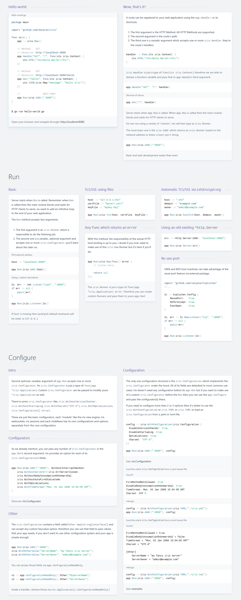

# Iris Web Framework

[](https://travis-ci.org/kataras/iris)[](http://goreportcard.com/report/kataras/iris)[](https://github.com/kataras/iris/issues?q=is%3Aissue+is%3Aclosed)[](https://github.com/kataras/iris/releases)[](https://github.com/kataras/iris/tree/master/_examples)[](https://kataras.rocket.chat/channel/iris)[](https://cla-assistant.io/kataras/iris)

Iris is a fast, simple and efficient web framework for Go.

Iris provides a beautifully expressive and easy to use foundation for your next website, API, or distributed app.

Learn what [others say about Iris](https://www.youtube.com/watch?v=jGx0LkuUs4A) and [star](https://github.com/kataras/iris/stargazers) this github repository to stay [up to date](https://facebook.com/iris.framework).


## Sponsors

Support this project by becoming a sponsor. Your logo will show up here with a link to your website. [Become a sponsor](https://opencollective.com/iris#sponsor)

<a href="https://opencollective.com/iris/sponsor/0/website" target="_blank"></a>
<a href="https://opencollective.com/iris/sponsor/1/website" target="_blank">

## [Benchmarks](_benchmarks)

[](_benchmarks/README_UNIX.md)

<details>
<summary>Benchmarks from third-party source over the rest web frameworks</summary>


_Updated at: [Tuesday, 21 November 2017](_benchmarks/README_UNIX.md)_
</details>

## Installation

The only requirement is the [Go Programming Language](https://golang.org/dl/)

```sh
$ go get -u github.com/kataras/iris
```

Iris takes advantage of the [vendor directory](https://docs.google.com/document/d/1Bz5-UB7g2uPBdOx-rw5t9MxJwkfpx90cqG9AFL0JAYo) feature. You get truly reproducible builds, as this method guards against upstream renames and deletes.

### Learn

[](https://iris-go.com/v10)

## Articles

* [Top 6 web frameworks for Go as of 2017](https://blog.usejournal.com/top-6-web-frameworks-for-go-as-of-2017-23270e059c4b)
* [Iris Go Framework + MongoDB](https://medium.com/go-language/iris-go-framework-mongodb-552e349eab9c)
* [How to build a file upload form using DropzoneJS and Go](https://hackernoon.com/how-to-build-a-file-upload-form-using-dropzonejs-and-go-8fb9f258a991)
* [How to display existing files on server using DropzoneJS and Go](https://hackernoon.com/how-to-display-existing-files-on-server-using-dropzonejs-and-go-53e24b57ba19)
* [Iris, a modular web framework](https://medium.com/@corebreaker/iris-web-cd684b4685c7)
* [Go vs .NET Core in terms of HTTP performance](https://medium.com/@kataras/go-vs-net-core-in-terms-of-http-performance-7535a61b67b8)
* [Iris Go vs .NET Core Kestrel in terms of HTTP performance](https://hackernoon.com/iris-go-vs-net-core-kestrel-in-terms-of-http-performance-806195dc93d5)
* [How to Turn an Android Device into a Web Server](https://twitter.com/ThePracticalDev/status/892022594031017988)
* [Deploying a Iris Golang app in hasura](https://medium.com/@HasuraHQ/deploy-an-iris-golang-app-with-backend-apis-in-minutes-25a559bf530b)
* [A URL Shortener Service using Go, Iris and Bolt](https://medium.com/@kataras/a-url-shortener-service-using-go-iris-and-bolt-4182f0b00ae7)

[List of all Contributors](https://github.com/kataras/iris/graphs/contributors)

Help this project to continue deliver awesome and unique features with the higher code quality as possible by donating any amount via [PayPal](https://www.paypal.me/kataras) or [BTC](https://iris-go.com/v8/donate).

For more information about contributing to the Iris project please check the [CONTRIBUTING.md file](CONTRIBUTING.md).

## License

Iris is licensed under the 3-Clause BSD [License](LICENSE). Iris is 100% open-source software.

For any questions regarding the license please [contact us](mailto:kataras2006@hotmail.com?subject=Iris%20License).
