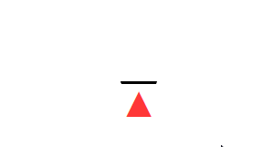

<!-- #  Iris 
-->
<p align="center">

</p>

Iris is a fast, simple and efficient micro web framework for Go. It provides a beautifully expressive and easy to use foundation for your next website, API, or distributed app.

[Star or watch](https://github.com/kataras/iris/stargazers) this repository, it is still in **active development mode**.

<!-- [](http://iris-go.com/graph) -->
[](https://travis-ci.org/kataras/iris)
[](http://goreportcard.com/report/kataras/iris)
[](https://github.com/kataras/iris/issues?q=is%3Aopen+is%3Aissue)
[](https://github.com/kataras/iris/issues?q=is%3Aissue+is%3Aclosed)
[](https://github.com/kataras/iris/tree/master/_examples)
[](https://kataras.rocket.chat/channel/iris)

<!-- has issues, the img.shields.io's API is problematic for this resource: [](https://github.com/kataras/iris/issues?q=is%3Aissue+is%3Aclosed) -->
<!-- [](https://godoc.org/github.com/kataras/iris) -->

<p>

</p>

### 📑 Table of contents

* [Installation](#-installation)
* [Latest changes](https://github.com/kataras/iris/blob/master/HISTORY.md#su-13-august-2017--v825)
* [Learn](#-learn)
	* [HTTP Listening](_examples/#http-listening)
	* [Configuration](_examples/#configuration)
	* [Routing, Grouping, Controllers, Dynamic Path Parameters, "Macros" and Custom Context](_examples/#routing-grouping-dynamic-path-parameters-macros-and-custom-context)
	* [Subdomains](_examples/#subdomains)
	* [Wrap `http.Handler/HandlerFunc`](_examples/#convert-httphandlerhandlerfunc)
	* [View](_examples/#view)
	* [Authentication](_examples/#authentication)
	* [File Server](_examples/#file-server)
	* [How to Read from `context.Request() *http.Request`](_examples/#how-to-read-from-contextrequest-httprequest)
	* [How to Write to `context.ResponseWriter() http.ResponseWriter`](_examples/#how-to-write-to-contextresponsewriter-httpresponsewriter)
	* [Test](_examples/#testing)	
	* [Cache](_examples/#caching)
	* [Sessions](_examples/#sessions)
	* [Websockets](_examples/#websockets)
	* [Miscellaneous](_examples/#miscellaneous)
	* [Typescript Automation Tools](typescript/#table-of-contents)
	* [Tutorial: Online Visitors](_examples/tutorial/online-visitors)
	* [Tutorial: URL Shortener using BoltDB](https://medium.com/@kataras/a-url-shortener-service-using-go-iris-and-bolt-4182f0b00ae7)
	* [Tutorial: How to turn your Android Device into a fully featured Web Server (**MUST**)](https://twitter.com/ThePracticalDev/status/892022594031017988)
	* [POC: Convert the medium-sized project "Parrot" from native to Iris](https://github.com/iris-contrib/parrot)
* [Middleware](middleware/)
* [Dockerize](https://github.com/iris-contrib/cloud-native-go)
* [Community & Support](#-community)
* [Blogs](http://iris-go.com/v8/blogs)
* [Versioning](#-version)
    * [When should I upgrade?](#should-i-upgrade-my-iris)
    * [Where can I find older versions?](#where-can-i-find-older-versions)
* [Get Hired](#-get-hired)
* [People](#-people)

### 🚀 Installation

The only requirement is the [Go Programming Language](https://golang.org/dl/), at least version 1.8

```sh
$ go get -u github.com/kataras/iris
```

> _iris_ takes advantage of the [vendor directory](https://docs.google.com/document/d/1Bz5-UB7g2uPBdOx-rw5t9MxJwkfpx90cqG9AFL0JAYo) feature. You get truly reproducible builds, as this method guards against upstream renames and deletes.

```go
// file: main.go
package main
import (
    "github.com/kataras/iris"
    "github.com/kataras/iris/context"
)
func main() {
    app := iris.New()
    // Load all templates from the "./templates" folder
    // where extension is ".html" and parse them
    // using the standard `html/template` package.
    app.RegisterView(iris.HTML("./templates", ".html"))

    // Method:    GET
    // Resource:  http://localhost:8080
    app.Get("/", func(ctx context.Context) {
        // Bind: {{.message}} with "Hello world!"
        ctx.ViewData("message", "Hello world!")
        // Render template file: ./templates/hello.html
        ctx.View("hello.html")
    })

    // Start the server using a network address and block.
    app.Run(iris.Addr(":8080"))
}
```
```html
<!-- file: ./templates/hello.html -->
<html>
<head>
    <title>Hello Page</title>
</head>
<body>
    <h1>{{.message}}</h1>
</body>
</html>
```

```sh 
$ go run main.go
> Now listening on: http://localhost:8080
> Application started. Press CTRL+C to shut down.
```

<details>
<summary>Hello World with Go 1.9</summary>

If you've installed Go 1.9 then you can omit the `github.com/kataras/iris/context` package from the imports statement.

```go
// +build go1.9

package main

import "github.com/kataras/iris"

func main() {
	app := iris.New()
	app.RegisterView(iris.HTML("./templates", ".html"))
	
	app.Get("/", func(ctx iris.Context) {
		ctx.ViewData("message", "Hello world!")
		ctx.View("hello.html")
	})

	app.Run(iris.Addr(":8080"))
}
```

We expect Go version 1.9 to be released in August, however you can install Go 1.9 RC2 today.

### Installing Go 1.9rc2
 
1. Go to https://golang.org/dl/#go1.9rc2
2. Download a compatible, with your OS, archive or executable, i.e `go1.9rc2.windows-amd64.zip`
3. Unzip the contents of `go1.9rc2.windows-amd64.zip` folder to your $GOROOT, i.e `C:\Go` or just execute the executable you've just download
4. Open a terminal and execute `go version`, it should output the go1.9rc2 version, i.e:
```sh
C:\Users\kataras>go version
go version go1.9rc2 windows/amd64
```

</details>

<details>
<summary>Why a new web framework</summary>

### Why

Go is a great technology stack for building scalable, web-based, back-end systems for web 
applications. 

When you think about building web applications and web APIs, or simply building HTTP servers in Go, does your mind go to the standard net/http package?
Then you have to deal with some common situations like dynamic routing (a.k.a parameterized), security and authentication, real-time communication and many other issues that net/http doesn't solve. 

The net/http package is not complete enough to quickly build well-designed back-end web systems. When you realize this, you might be thinking along these lines:

- Ok, the net/http package doesn't suit me, but there are so many frameworks, which one will work for me?!
- Each one of them tells me that it is the best. I don't know what to do!

##### The truth

I did some deep research and benchmarks with 'wrk' and 'ab' in order to choose which framework would suit me and my new project. The results, sadly, were really disappointing to me.

I started wondering if golang wasn't as fast on the web as I had read... but, before I let Golang go and continued to develop with nodejs, I told myself:

> '**Makis, don't lose hope, give at least a chance to Golang. Try to build something totally new without basing it off the "slow" code you saw earlier; learn the secrets of this language and make *others* follow your steps!**'.

These are the words I told myself that day [**13 March 2016**]. 

The same day, later the night, I was reading a book about Greek mythology. I saw an ancient goddess' name and was inspired immediately to give a name to this new web framework (which I had already started writing) - **Iris**.

 I'm still here [because Iris has succeed in being the fastest go web framework](https://raw.githubusercontent.com/smallnest/go-web-framework-benchmark/4db507a22c964c9bc9774c5b31afdc199a0fe8b7/benchmark.png)

[](https://twitter.com/ThePracticalDev/status/892022594031017988) 


---- 

_iris_ is easy, it has a familiar API while in the same has far more features than [Gin](https://github.com/gin-gonic/gin) or [Martini](https://github.com/go-martini/martini).

You own your code —it will never generate (unfamiliar) code for you, like [Beego](https://github.com/astaxie/beego), [Revel](https://github.com/revel/revel) and [Buffalo](https://github.com/gobuffalo/buffalo) do.

It's not just-another-router but its overall performance is equivalent with something like [httprouter](https://github.com/julienschmidt/httprouter).

Unlike [fasthttp](https://github.com/valyala/fasthttp), iris provides full HTTP/2 support for free.

Compared to the rest open source projects, this one is very active and you get answers almost immediately.

### 🔥 Hot Features

- Focus on high performance
- Easy Fluent API
- Highly customizable
- Robust routing and middleware ecosystem
    * Build RESTful APIs with iris unique expressionist path interpreter
	* Dynamic path parameterized or wildcard routes are not conflict with static routes 
	* Remove trailing slash from the URL with option to redirect
	* Virtual hosts and subdomains made easy
	* Group API's and static or even dynamic subdomains
	* MVC [**NEW**](_examples/routing/mvc)
	* `net/http` and `negroni-like` handlers are compatible via `iris.FromStd` 
	* Register custom handlers for any HTTP error
	* Transactions and rollback when you need it
	* Cache the response when you need it
	* A single function to serve your embedded assets, always compatible with `go-bindata`
	* HTTP to HTTPS
 	* HTTP to HTTPS WWW
	* [learn the reasons that differ from what you've seen so far](_examples/#routing-grouping-dynamic-path-parameters-macros-and-custom-context)
- Context
	* Highly scalable rich content render (Markdown, JSON, JSONP, XML...)
	* Body binders and handy functions to send HTTP responses
	* Limit request body
	* Serve static resources or embedded assets
	* Localization i18N
	* Compression (Gzip is built'n)
- Authentication
	* Basic Authentication
	* OAuth, OAuth2 supporting 27+ popular websites
	* JWT
- Server
	* Automatically install and serve certificates from https://letsencrypt.org when serving via TLS
	* Gracefully shutdown by-default
	* Register on shutdown, error or interrupt events
	* Attach more than one server, fully compatible with `net/http#Server`
- View system: supporting 5 template engines. Fully compatible with `html/template`
- HTTP Sessions library [you can still use your favorite if you want to]
- Websocket library, its API similar to socket.io [you can still use your favorite if you want to]
- Hot Reload on source code changes[*](https://github.com/kataras/rizla)
- Typescript integration + Web IDE
- And many other things that will surprise you

</details>

### 📖 Learn

<a href="https://github.com/kataras/iris/_examples" alt="documentation and examples">
	
</a>

The _iris_ philosophy is to provide robust tooling for HTTP, making it a great solution for single page applications, web sites, hybrids, or public HTTP APIs. Keep note that, today, iris is faster than apache+nginx itself.

_iris_ does not force you to use any specific ORM. With support for the most popular template engines, websocket server and a fast sessions manager you can quickly craft your perfect application.


The awesome _iris_ community is always adding new examples, [_examples](_examples/) is a great place to get started!

Read the [godocs](https://godoc.org/github.com/kataras/iris) for a better understanding.

### 👥 Community

Join the welcoming community of fellow _iris_ developers in [rocket.chat](https://kataras.rocket.chat/channel/iris)

- [Post](http://support.iris-go.com) a feature request or report a bug
- :star: and watch the public [repository](https://github.com/kataras/iris/stargazers), will keep you up to date
- :earth_americas: publish [an article](https://medium.com/search?q=iris) or share a [tweet](https://twitter.com/hashtag/golang) about your personal experience with iris.


The most useful community repository for _iris_ developers is the 
[iris-contrib/middleware](https://github.com/iris-contrib/middleware) which contains some HTTP handlers that can help you finish a lot of your tasks even easier. Feel free to push your own middleware there!

```sh
$ go get -u github.com/iris-contrib/middleware/...
```

#### 📈 One and a half years with You...

- 7210 github stars
- 766 github forks
- 1m total views at its documentation
- ~800$ at donations (there're a lot for a golang open-source project, thanks to you)
- ~554 reported bugs fixed
- ~30 community feature requests have been implemented

Thank You for your trust!

### 📌 Version

Current: [VERSION](VERSION)

Each new release is pushed to the master. It stays there until the next version. When a next version is released then the previous version goes to its own branch with `gopkg.in` as its import path (and its own vendor folder), in order to keep it working "for-ever".

Changelog of the current version can be found at the [HISTORY](HISTORY.md) file.

#### Should I upgrade my iris?

Developers are not forced to use the latest _iris_ version, they can use any version in production, they can update at any time they want.

Testers should upgrade immediately, if you're willing to use _iris_ in production you can wait a little more longer, transaction should be as safe as possible.

#### Where can I find older versions?

Previous versions can be found at [releases page](https://github.com/kataras/iris/releases).

### 😃 Get Hired

Below you'll find a list of open positions that require at least **experience with the Iris web framework**.

| Company | Position | Job Details |
| -----------|--------|-------------|
| Kudo, an Indonesian startup technology company | Application Programming Interface Developer | Navigate to: https://glints.id/opportunities/jobs/5553 |

Employers that are looking for brilliant Software Engineers with good experience on Go Programming Language and Iris can put their startup's or company's name here or, if privacy is the key, [contact with us](mailto:kataras2006@hotmail.com?subject=Employer%20That%20Hires%20Smart%20Devs) to suggest some good and well-tested freelancers that suits your needs.

### 🥇 People

The original author of _iris_ is [Gerasimos Maropoulos](https://medium.com/@kataras)

The current lead maintainer is [Bill Qeras, Jr.](https://github.com/hiveminded)

[List of all contributors](https://github.com/kataras/iris/graphs/contributors)

Help this project to continue deliver awesome and unique features with the higher code quality as possible

[](https://www.paypal.com/cgi-bin/webscr?cmd=_donations&business=kataras2006%40hotmail%2ecom&lc=GR&item_name=Iris%20web%20framework&item_number=iriswebframeworkdonationid2016&currency_code=EUR&bn=PP%2dDonationsBF%3abtn_donateCC_LG%2egif%3aNonHosted)