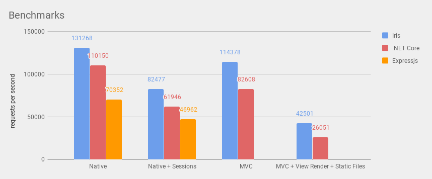
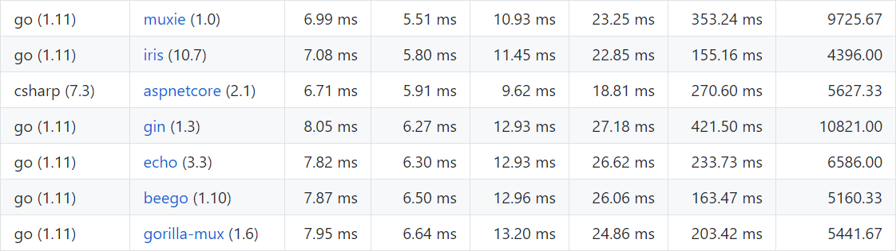

# ⚡️ Update: community-driven version 11.1.0

Click [here](HISTORY.md#su-18-november-2018--v1110) to read about the versioning API that the most recent version of Iris brings to you.

# Iris Web Framework <a href="README_ZH.md"> </a> <a href="README_RU.md"></a> <a href="README_ID.md"> </a> <a href="README_GR.md"></a> <a href="README_PT_BR.md"></a> <a href="README_JPN.md"></a>

<a href="https://iris-go.com">  </a>

[](https://travis-ci.org/kataras/iris)<!-- [](https://github.com/kataras/iris/releases)--> [](http://goreportcard.com/report/kataras/iris) [](https://marketplace.visualstudio.com/items?itemName=kataras2006.iris)<!--[](https://github.com/kataras/iris/issues?q=is%3Aissue+is%3Aclosed)--> [](https://kataras.rocket.chat/channel/iris) [](https://github.com/kataras/iris/tree/master/_examples/routing) [](https://github.com/kataras/iris/releases)

Iris is a fast, simple yet fully featured and very efficient web framework for Go.

Iris provides a beautifully expressive and easy to use foundation for your next website or API.

Iris offers a complete and decent solution and support for all gophers around the globe.

Learn what [others say about Iris](#support) and [star](https://github.com/kataras/iris/stargazers) this github repository to stay [up to date](https://facebook.com/iris.framework).

## Installation

The only requirement is the [Go Programming Language](https://golang.org/dl/)

```sh
$ go get -u github.com/kataras/iris
```

Iris takes advantage of the [vendor directory](https://docs.google.com/document/d/1Bz5-UB7g2uPBdOx-rw5t9MxJwkfpx90cqG9AFL0JAYo) feature. You get truly reproducible builds, as this method guards against upstream renames and deletes.

<details>
<summary>Known issues for code editors and IDEs at general</summary>

### VS Code

For some reason the latest [vscode-go language extension](https://github.com/Microsoft/vscode-go) does not provide enough intelligence for the `iris.Context` type alias (input parameters documentation and definition navigation).
Probably you have already experienced this issue with other Go libraries too, it is not an iris-specific issue, it is a general issue for all Golang type aliases.

Therefore if you use [VS Code](https://code.visualstudio.com/) and you need these editor's features, import the original path; add an extra import statement of the original path of the `Context`, that will do it:

```go
import (
    "github.com/kataras/iris"
    "github.com/kataras/iris/context" // <- HERE
)
```

</details>

## Benchmarks

### Iris vs .NET Core vs Expressjs

[](_benchmarks/README.md)

_Updated at: [Monday, 22 October 2018](_benchmarks/README.md)_

### Iris vs the rest Go web frameworks and routers vs any other alternative

[](https://github.com/the-benchmarker/web-frameworks#full-table)

As shown in the benchmarks (from a [third-party source](https://github.com/the-benchmarker)), Iris is the fastest open-source Go web framework in the planet. The net/http 100% compatible router [muxie](https://github.com/kataras/muxie) I've created some weeks ago is also trending there with amazing results, fastest net/http router ever created as well. View the results at:

https://github.com/the-benchmarker/web-frameworks#full-table

## Philosophy

The Iris philosophy is to provide robust tooling for HTTP, making it a great solution for single page applications, web sites, hybrids, or public HTTP APIs. Keep note that, so far, iris is the fastest web framework ever created in terms of performance.

Iris does not force you to use any specific ORM or template engine. With support for the most used template engines, you can quickly craft the perfect application.

## Quick start
 
```sh
# assume the following codes in example.go file
$ cat example.go
```

```go
package main

import "github.com/kataras/iris"

func main() {
    app := iris.Default()
    app.Get("/ping", func(ctx iris.Context) {
        ctx.JSON(iris.Map{
            "message": "pong",
        })
    })
    // listen and serve on http://0.0.0.0:8080.
    app.Run(iris.Addr(":8080"))
}
```

```
# run example.go and visit http://0.0.0.0:8080/ping on browser
$ go run example.go
```

## Iris starter kits

<!-- table form
| Description | Link |
| -----------|-------------|
| Hasura hub starter project with a ready to deploy golang helloworld webapp with IRIS! | https://hasura.io/hub/project/hasura/hello-golang-iris |
| A basic web app built in Iris for Go |https://github.com/gauravtiwari/go_iris_app |
| A mini social-network created with the awesome Iris💖💖 | https://github.com/iris-contrib/Iris-Mini-Social-Network |
| Iris isomorphic react/hot reloadable/redux/css-modules starter kit | https://github.com/iris-contrib/iris-starter-kit |
| Demo project with react using typescript and Iris | https://github.com/ionutvilie/react-ts |
| Self-hosted Localization Management Platform built with Iris and Angular | https://github.com/iris-contrib/parrot |
| Iris + Docker and Kubernetes | https://github.com/iris-contrib/cloud-native-go |
| Quickstart for Iris with Nanobox | https://guides.nanobox.io/golang/iris/from-scratch |
-->

1. [snowlyg/IrisApiProject: Iris + gorm + jwt + sqlite3](https://github.com/snowlyg/IrisApiProject) **NEW-Chinese**
2. [yz124/superstar: Iris + xorm to implement the star library](https://github.com/yz124/superstar) **NEW-Chinese**
3. [jebzmos4/Iris-golang: A basic CRUD API in golang with Iris](https://github.com/jebzmos4/Iris-golang)
4. [gauravtiwari/go_iris_app: A basic web app built in Iris for Go](https://github.com/gauravtiwari/go_iris_app)
5. [A mini social-network created with the awesome Iris💖💖](https://github.com/iris-contrib/Iris-Mini-Social-Network)
6. [Iris isomorphic react/hot reloadable/redux/css-modules starter kit](https://github.com/iris-contrib/iris-starter-kit)
7. [ionutvilie/react-ts: Demo project with react using typescript and Iris](https://github.com/ionutvilie/react-ts)
8. [Self-hosted Localization Management Platform built with Iris and Angular](https://github.com/iris-contrib/parrot)
9. [Iris + Docker and Kubernetes](https://github.com/iris-contrib/cloud-native-go)
10. [nanobox.io: Quickstart for Iris with Nanobox](https://guides.nanobox.io/golang/iris/from-scratch)
11. [hasura.io: A Hasura starter project with a ready to deploy Golang hello-world web app with IRIS](https://hasura.io/hub/project/hasura/hello-golang-iris)

> Did you build something similar? Let us [know](https://github.com/kataras/iris/pulls)!

## API Examples

### Using Get, Post, Put, Patch, Delete and Options

```go
func main() {
    // Creates an application with default middleware:
    // logger and recovery (crash-free) middleware.
    app := iris.Default()

    app.Get("/someGet", getting)
    app.Post("/somePost", posting)
    app.Put("/somePut", putting)
    app.Delete("/someDelete", deleting)
    app.Patch("/somePatch", patching)
    app.Head("/someHead", head)
    app.Options("/someOptions", options)

    app.Run(iris.Addr(":8080"))
}
```

### Parameters in path

| Param Type | Go Type | Validation | Retrieve Helper |
| -----------------|------|-------------|------|
| `:string` | string | anything (single path segment) | `Params().Get` |
| `:int` | int | -9223372036854775808 to 9223372036854775807 (x64) or -2147483648 to 2147483647 (x32), depends on the host arch | `Params().GetInt` |
| `:int8` | int8 | -128 to 127 | `Params().GetInt8` |
| `:int16` | int16 | -32768 to 32767 | `Params().GetInt16` |
| `:int32` | int32 | -2147483648 to 2147483647 | `Params().GetInt32` |
| `:int64` | int64 | -9223372036854775808 to 9223372036854775807 | `Params().GetInt64` |
| `:uint` | uint | 0 to 18446744073709551615 (x64) or 0 to 4294967295 (x32), depends on the host arch | `Params().GetUint` |
| `:uint8` | uint8 | 0 to 255 | `Params().GetUint8` |
| `:uint16` | uint16 | 0 to 65535 | `Params().GetUint16` |
| `:uint32` | uint32 | 0 to 4294967295 | `Params().GetUint32` |
| `:uint64` | uint64 | 0 to 18446744073709551615 | `Params().GetUint64` |
| `:bool` | bool | "1" or "t" or "T" or "TRUE" or "true" or "True" or "0" or "f" or "F" or "FALSE" or "false" or "False" | `Params().GetBool` |
| `:alphabetical` | string | lowercase or uppercase letters | `Params().Get` |
| `:file` | string | lowercase or uppercase letters, numbers, underscore (_), dash (-), point (.) and no spaces or other special characters that are not valid for filenames | `Params().Get` |
| `:path` | string | anything, can be separated by slashes (path segments) but should be the last part of the route path | `Params().Get` | 

**Usage**:

```go
app.Get("/users/{id:uint64}", func(ctx iris.Context){
    id := ctx.Params().GetUint64Default("id", 0)
    // [...]
})
```

| Built'n Func | Param Types |
| -----------|---------------|
| `regexp`(expr string) | :string |
| `prefix`(prefix string) | :string |
| `suffix`(suffix string) | :string |
| `contains`(s string) | :string |
| `min`(minValue int or int8 or int16 or int32 or int64 or uint8 or uint16 or uint32 or uint64  or float32 or float64) | :string(char length), :int, :int8, :int16, :int32, :int64, :uint, :uint8, :uint16, :uint32, :uint64  |
| `max`(maxValue int or int8 or int16 or int32 or int64 or uint8 or uint16 or uint32 or uint64 or float32 or float64) | :string(char length), :int, :int8, :int16, :int32, :int64, :uint, :uint8, :uint16, :uint32, :uint64 |
| `range`(minValue, maxValue int or int8 or int16 or int32 or int64 or uint8 or uint16 or uint32 or uint64 or float32 or float64) | :int, :int8, :int16, :int32, :int64, :uint, :uint8, :uint16, :uint32, :uint64 |

**Usage**:

```go
app.Get("/profile/{name:alphabetical max(255)}", func(ctx iris.Context){
    name := ctx.Params().Get("name")
    // len(name) <=255 otherwise this route will fire 404 Not Found
    // and this handler will not be executed at all.
})
```

**Do It Yourself**:

The `RegisterFunc` can accept any function that returns a `func(paramValue string) bool`.
Or just a `func(string) bool`.
If the validation fails then it will fire `404` or whatever status code the `else` keyword has.

```go
latLonExpr := "^-?[0-9]{1,3}(?:\\.[0-9]{1,10})?$"
latLonRegex, _ := regexp.Compile(latLonExpr)

// Register your custom argument-less macro function to the :string param type.
// MatchString is a type of func(string) bool, so we use it as it is.
app.Macros().Get("string").RegisterFunc("coordinate", latLonRegex.MatchString)

app.Get("/coordinates/{lat:string coordinate()}/{lon:string coordinate()}", func(ctx iris.Context) {
    ctx.Writef("Lat: %s | Lon: %s", ctx.Params().Get("lat"), ctx.Params().Get("lon"))
})
```

Register your custom macro function which accepts two int arguments.

```go

app.Macros().Get("string").RegisterFunc("range", func(minLength, maxLength int) func(string) bool {
    return func(paramValue string) bool {
        return len(paramValue) >= minLength && len(paramValue) <= maxLength
    }
})

app.Get("/limitchar/{name:string range(1,200) else 400}", func(ctx iris.Context) {
    name := ctx.Params().Get("name")
    ctx.Writef(`Hello %s | the name should be between 1 and 200 characters length
    otherwise this handler will not be executed`, name)
})
```

Register your custom macro function which accepts a slice of strings `[...,...]`.

```go
app.Macros().Get("string").RegisterFunc("has", func(validNames []string) func(string) bool {
    return func(paramValue string) bool {
        for _, validName := range validNames {
            if validName == paramValue {
                return true
            }
        }

        return false
    }
})

app.Get("/static_validation/{name:string has([kataras,gerasimos,maropoulos])}", func(ctx iris.Context) {
    name := ctx.Params().Get("name")
    ctx.Writef(`Hello %s | the name should be "kataras" or "gerasimos" or "maropoulos"
    otherwise this handler will not be executed`, name)
})
```

**Example Code**:

```go
func main() {
    app := iris.Default()

    // This handler will match /user/john but will not match neither /user/ or /user.
    app.Get("/user/{name}", func(ctx iris.Context) {
        name := ctx.Params().Get("name")
        ctx.Writef("Hello %s", name)
    })

    // This handler will match /users/42
    // but will not match /users/-1 because uint should be bigger than zero
    // neither /users or /users/.
    app.Get("/users/{id:uint64}", func(ctx iris.Context) {
        id := ctx.Params().GetUint64Default("id", 0)
        ctx.Writef("User with ID: %d", id)
    })

    // However, this one will match /user/john/send and also /user/john/everything/else/here
    // but will not match /user/john neither /user/john/.
    app.Post("/user/{name:string}/{action:path}", func(ctx iris.Context) {
        name := ctx.Params().Get("name")
        action := ctx.Params().Get("action")
        message := name + " is " + action
        ctx.WriteString(message)
    })

    app.Run(iris.Addr(":8080"))
}
```

> If parameter type is missing then defaults to `string`, therefore `{name:string}` and `{name}` do the same exactly thing.

> Learn more about path parameter's types by navigating [here](_examples/routing/dynamic-path/main.go#L31).


### Dependency Injection

The package [hero](hero) contains features for binding any object or functions that `handlers` can use, these are called dependencies.

With Iris you get truly safe bindings thanks to the [hero](_examples/hero) [package](hero). It is blazing-fast, near to raw handlers performance because Iris calculates everything before even server goes online!

Below you will see some screenshots I prepared for you in order to be easier to understand:

#### 1. Path Parameters - Built'n Dependencies


#### 2. Services - Static Dependencies


#### 3. Per-Request - Dynamic Dependencies


`hero funcs` are very easy to understand and when you start using them **you never go back**.

> With Iris you also get real and [blazing-fast](_benchmarks) [MVC support](_examples/mvc) which uses "hero" under the hoods.

### Querystring parameters

```go
func main() {
    app := iris.Default()

    // Query string parameters are parsed using the existing underlying request object.
    // The request responds to a url matching:  /welcome?firstname=Jane&lastname=Doe.
    app.Get("/welcome", func(ctx iris.Context) {
        firstname := ctx.URLParamDefault("firstname", "Guest")
        // shortcut for ctx.Request().URL.Query().Get("lastname").
        lastname := ctx.URLParam("lastname") 

        ctx.Writef("Hello %s %s", firstname, lastname)
    })

    app.Run(iris.Addr(":8080"))
}
```

### Multipart/Urlencoded Form

```go
func main() {
    app := iris.Default()

    app.Post("/form_post", func(ctx iris.Context) {
        message := ctx.FormValue("message")
        nick := ctx.FormValueDefault("nick", "anonymous")

        ctx.JSON(iris.Map{
            "status":  "posted",
            "message": message,
            "nick":    nick,
        })
    })

    app.Run(iris.Addr(":8080"))
}
```

### Another example: query + post form

```
POST /post?id=1234&page=1 HTTP/1.1
Content-Type: application/x-www-form-urlencoded

name=manu&message=this_is_great
```

```go
func main() {
    app := iris.Default()

    app.Post("/post", func(ctx iris.Context) {
        id := ctx.URLParam("id")
        page := ctx.URLParamDefault("page", "0")
        name := ctx.FormValue("name")
        message := ctx.FormValue("message")
        // or `ctx.PostValue` for POST, PUT & PATCH-only HTTP Methods.

        app.Logger().Infof("id: %s; page: %s; name: %s; message: %s", id, page, name, message)
    })

    app.Run(iris.Addr(":8080"))
}
```

```
id: 1234; page: 1; name: manu; message: this_is_great
```

### Extract Referer

```go
package main

import (
    "github.com/kataras/iris"
    "github.com/kataras/iris/context"
)

func main() {
    app := iris.New()

    app.Get("/", func(ctx context.Context) /* or iris.Context, it's the same for Go 1.9+. */ {

        // request header "referer" or url parameter "referer".
        r := ctx.GetReferrer()
        switch r.Type {
        case context.ReferrerSearch:
            ctx.Writef("Search %s: %s\n", r.Label, r.Query)
            ctx.Writef("Google: %s\n", r.GoogleType)
        case context.ReferrerSocial:
            ctx.Writef("Social %s\n", r.Label)
        case context.ReferrerIndirect:
            ctx.Writef("Indirect: %s\n", r.URL)
        }
    })

    app.Run(iris.Addr(":8080"))
}
```

How to `curl`:

```bash
curl http://localhost:8080?referer=https://twitter.com/Xinterio/status/1023566830974251008
curl http://localhost:8080?referer=https://www.google.com/search?q=Top+6+golang+web+frameworks&oq=Top+6+golang+web+frameworks
```

### Upload files

- [single file upload](_examples/http_request/upload-file/main.go)
- [multi file upload](_examples/http_request/upload-files)

```go
const maxSize = 5 << 20 // 5MB

func main() {
    app := iris.Default()
    app.Post("/upload", iris.LimitRequestBodySize(maxSize), func(ctx iris.Context) {
        //
        // UploadFormFiles
        // uploads any number of incoming files ("multiple" property on the form input).
        //

        // The second, optional, argument
        // can be used to change a file's name based on the request,
        // at this example we will showcase how to use it
        // by prefixing the uploaded file with the current user's ip.
        ctx.UploadFormFiles("./uploads", beforeSave)
    })

    app.Run(iris.Addr(":8080"))
}

func beforeSave(ctx iris.Context, file *multipart.FileHeader) {
    ip := ctx.RemoteAddr()
    // make sure you format the ip in a way
    // that can be used for a file name (simple case):
    ip = strings.Replace(ip, ".", "_", -1)
    ip = strings.Replace(ip, ":", "_", -1)

    // you can use the time.Now, to prefix or suffix the files
    // based on the current time as well, as an exercise.
    // i.e unixTime :=	time.Now().Unix()
    // prefix the Filename with the $IP-
    // no need for more actions, internal uploader will use this
    // name to save the file into the "./uploads" folder.
    file.Filename = ip + "-" + file.Filename
}
```

How to `curl`:

```bash
curl -X POST http://localhost:8080/upload \
  -F "files[]=@./myfile.zip" \
  -F "files[]=@./mysecondfile.zip" \
  -H "Content-Type: multipart/form-data"
```

### Grouping routes

```go
func main() {
	app := iris.Default()

	// Simple group: v1.
	v1 := app.Party("/v1")
	{
		v1.Post("/login", loginEndpoint)
		v1.Post("/submit", submitEndpoint)
		v1.Post("/read", readEndpoint)
	}

	// Simple group: v2.
	v2 := app.Party("/v2")
	{
		v2.Post("/login", loginEndpoint)
		v2.Post("/submit", submitEndpoint)
		v2.Post("/read", readEndpoint)
	}

	app.Run(iris.Addr(":8080"))
}
```

### Blank Iris without middleware by default

Use

```go
app := iris.New()
```

instead of

```go
// Default with the Logger and Recovery middleware already attached.
app := iris.Default()
```

### Using middleware

```go
import (
    "github.com/kataras/iris"

    "github.com/kataras/iris/middleware/recover"
    "github.com/kataras/iris/middleware/logger"
)

func main() {
    // Creates an application without any middleware by default.
    app := iris.New()

    // Recover middleware recovers from any panics and writes a 500 if there was one.
    app.Use(recover.New())

    requestLogger := logger.New(logger.Config{
        // Status displays status code
        Status: true,
        // IP displays request's remote address
        IP: true,
        // Method displays the http method
        Method: true,
        // Path displays the request path
        Path: true,
        // Query appends the url query to the Path.
        Query: true,

        // if !empty then its contents derives from `ctx.Values().Get("logger_message")
        // will be added to the logs.
        MessageContextKeys: []string{"logger_message"},

        // if !empty then its contents derives from `ctx.GetHeader("User-Agent")
        MessageHeaderKeys: []string{"User-Agent"},
    })
    app.Use(requestLogger)

    // Per route middleware, you can add as many as you desire.
    app.Get("/benchmark", MyBenchLogger(), benchEndpoint)

    // Authorization party /user.
    // authorized := app.Party("/user", AuthRequired())
    // exactly the same as:
    authorized := app.Party("/user")
    // per party middleware! in this case we use the custom created
    // AuthRequired() middleware just in the "authorized" group/party.
    authorized.Use(AuthRequired())
    {
        authorized.Post("/login", loginEndpoint)
        authorized.Post("/submit", submitEndpoint)
        authorized.Post("/read", readEndpoint)

        // nested group: /user/testing
        testing := authorized.Party("/testing")
        testing.Get("/analytics", analyticsEndpoint)
    }

    // Listen and serve on http://0.0.0.0:8080
    app.Run(iris.Addr(":8080"))
}
```

### How to write log file

```go
package main

import (
	"os"
	"time"

	"github.com/kataras/iris"
)

// Get a filename based on the date, just for the sugar.
func todayFilename() string {
    today := time.Now().Format("Jan 02 2006")
    return today + ".txt"
}

func newLogFile() *os.File {
    filename := todayFilename()
    // Open the file, this will append to the today's file if server restarted.
    f, err := os.OpenFile(filename, os.O_CREATE|os.O_WRONLY|os.O_APPEND, 0666)
    if err != nil {
        panic(err)
    }

    return f
}

func main() {
    f := newLogFile()
    defer f.Close()

    app := iris.New()
    // Attach the file as logger, remember, iris' app logger is just an io.Writer.
    // Use the following code if you need to write the logs to file and console at the same time.
    // app.Logger().SetOutput(io.MultiWriter(f, os.Stdout))
    app.Logger().SetOutput(f)

    app.Get("/ping", func(ctx iris.Context) {
        // for the sake of simplicity, in order see the logs at the ./_today_.txt
        ctx.Application().Logger().Infof("Request path: %s", ctx.Path())
        ctx.WriteString("pong")
    })

    // Navigate to http://localhost:8080/ping
    // and open the ./logs{TODAY}.txt file.
    app.Run(
        iris.Addr(":8080"),
        iris.WithoutBanner,
        iris.WithoutServerError(iris.ErrServerClosed),
    )
}
```

### Model binding and validation

Iris uses [**go-playground/validator.v9**](https://github.com/go-playground/validator) for validation. Check the full docs on tags usage [here](http://godoc.org/gopkg.in/go-playground/validator.v9#hdr-Baked_In_Validators_and_Tags).

Example [detail code](_examples/http_request/read-json-struct-validation/main.go).

Note that you need to set the corresponding binding tag on all fields you want to bind. For example, when binding from JSON, set `json:"fieldname"`.

```go
package main

import (
    "fmt"

    "github.com/kataras/iris"
    "gopkg.in/go-playground/validator.v9"
)

// User contains user information.
type User struct {
    FirstName      string     `json:"fname"`
    LastName       string     `json:"lname"`
    Age            uint8      `json:"age" validate:"gte=0,lte=130"`
    Email          string     `json:"email" validate:"required,email"`
    FavouriteColor string     `json:"favColor" validate:"hexcolor|rgb|rgba"`
    Addresses      []*Address `json:"addresses" validate:"required,dive,required"`
}

// Address houses a users address information.
type Address struct {
    Street string `json:"street" validate:"required"`
    City   string `json:"city" validate:"required"`
    Planet string `json:"planet" validate:"required"`
    Phone  string `json:"phone" validate:"required"`
}

// Use a single instance of Validate, it caches struct info.
var validate *validator.Validate

func main() {
    validate = validator.New()

    // Register validation for 'User'
    // NOTE: only have to register a non-pointer type for 'User', validator
    // internally dereferences during it's type checks.
    validate.RegisterStructValidation(UserStructLevelValidation, User{})

    app := iris.New()
    app.Post("/user", func(ctx iris.Context) {
        var user User
        if err := ctx.ReadJSON(&user); err != nil {
            // Handle error.
        }

        // Returns InvalidValidationError for bad validation input,
        // nil or ValidationErrors ( []FieldError )
        err := validate.Struct(user)
        if err != nil {

            // This check is only needed when your code could produce
            // an invalid value for validation such as interface with nil
            // value most including myself do not usually have code like this.
            if _, ok := err.(*validator.InvalidValidationError); ok {
                ctx.StatusCode(iris.StatusInternalServerError)
                ctx.WriteString(err.Error())
                return
            }

            ctx.StatusCode(iris.StatusBadRequest)
            for _, err := range err.(validator.ValidationErrors) {
                fmt.Println()
                fmt.Println(err.Namespace())
                fmt.Println(err.Field())
                fmt.Println(err.StructNamespace())
                fmt.Println(err.StructField())
                fmt.Println(err.Tag())
                fmt.Println(err.ActualTag())
                fmt.Println(err.Kind())
                fmt.Println(err.Type())
                fmt.Println(err.Value())
                fmt.Println(err.Param())
                fmt.Println()
            }

            return
        }

        // save user to database.
    })

    app.Run(iris.Addr(":8080"))
}

func UserStructLevelValidation(sl validator.StructLevel) {
    user := sl.Current().Interface().(User)

    if len(user.FirstName) == 0 && len(user.LastName) == 0 {
        sl.ReportError(user.FirstName, "FirstName", "fname", "fnameorlname", "")
        sl.ReportError(user.LastName, "LastName", "lname", "fnameorlname", "")
    }
}
```

```json
{
    "fname": "",
    "lname": "",
    "age": 45,
    "email": "mail@example.com",
    "favColor": "#000",
    "addresses": [{
        "street": "Eavesdown Docks",
        "planet": "Persphone",
        "phone": "none",
        "city": "Unknown"
    }]
}
```

### Websockets

```go
package main

import (
    "fmt"

    "github.com/kataras/iris"
    "github.com/kataras/iris/websocket"
)

func main() {
    app := iris.New()

    app.Get("/", func(ctx iris.Context) {
        ctx.ServeFile("websockets.html", false) // second parameter: enable gzip?
    })

    setupWebsocket(app)

    // x2
    // http://localhost:8080
    // http://localhost:8080
    // write something, press submit, see the result.
    app.Run(iris.Addr(":8080"))
}

func setupWebsocket(app *iris.Application) {
    // create our echo websocket server
    ws := websocket.New(websocket.Config{
        ReadBufferSize:  1024,
        WriteBufferSize: 1024,
    })
    ws.OnConnection(handleConnection)

    // register the server on an endpoint.
    // see the inline javascript code in the websockets.html,
    // this endpoint is used to connect to the server.
    app.Get("/echo", ws.Handler())
    // serve the javascript built'n client-side library,
    // see websockets.html script tags, this path is used.
    app.Any("/iris-ws.js", websocket.ClientHandler())
}

func handleConnection(c websocket.Connection) {
	// Read events from browser
    c.On("chat", func(msg string) {
        // Print the message to the console, c.Context() is the iris's http context.
        fmt.Printf("%s sent: %s\n", c.Context().RemoteAddr(), msg)
        // Write message back to the client message owner with:
        // c.Emit("chat", msg)
        // Write message to all except this client with:
        c.To(websocket.Broadcast).Emit("chat", msg)
    })
}
```

**websockets.html**

```html
<!-- the message's input -->
<input id="input" type="text" />

<!-- when clicked then an iris websocket event will be sent to the server,
at this example we registered the 'chat' -->
<button onclick="send()">Send</button>

<!-- the messages will be shown here -->
<pre id="output"></pre>
<!-- import the iris client-side library for browser-->
<script src="/iris-ws.js"></script>

<script>
    var scheme = document.location.protocol == "https:" ? "wss" : "ws";
    var port = document.location.port ? (":" + document.location.port) : "";
    // see app.Get("/echo", ws.Handler()) on main.go
    var wsURL = scheme + "://" + document.location.hostname + port+"/echo";

    var input = document.getElementById("input");
    var output = document.getElementById("output");

    // Ws comes from the auto-served '/iris-ws.js'
    var socket = new Ws(wsURL)
    socket.OnConnect(function () {
        output.innerHTML += "Status: Connected\n";
    });

    socket.OnDisconnect(function () {
        output.innerHTML += "Status: Disconnected\n";
    });

    // read events from the server
    socket.On("chat", function (msg) {
        addMessage(msg);
    });

    function send() {
        addMessage("Me: " + input.value); // write ourselves
        socket.Emit("chat", input.value); // send chat event data to the websocket server
        input.value = ""; // clear the input
    }

    function addMessage(msg) {
        output.innerHTML += msg + "\n";
    }
</script>
```

Navigate to the [_examples/websocket](_examples/websocket) folder for more.

### Cookies

> Are you looking about [http sessions instead?](_examples/sessions)

Let's write a simple application which will make use of the HTTP Cookies.

```sh
$ cat _examples/cookies/basic/main.go
```

```go
package main

import "github.com/kataras/iris"

func newApp() *iris.Application {
    app := iris.New()

    // Set A Cookie.
    app.Get("/cookies/{name}/{value}", func(ctx iris.Context) {
        name := ctx.Params().Get("name")
        value := ctx.Params().Get("value")

        ctx.SetCookieKV(name, value)

        ctx.Writef("cookie added: %s = %s", name, value)
    })

    // Retrieve A Cookie.
    app.Get("/cookies/{name}", func(ctx iris.Context) {
        name := ctx.Params().Get("name")

        value := ctx.GetCookie(name)

        ctx.WriteString(value)
    })

    // Delete A Cookie.
    app.Delete("/cookies/{name}", func(ctx iris.Context) {
        name := ctx.Params().Get("name")

        ctx.RemoveCookie(name)

        ctx.Writef("cookie %s removed", name)
    })

    return app
}

func main() {
    app := newApp()

    // GET:    http://localhost:8080/cookies/my_name/my_value
    // GET:    http://localhost:8080/cookies/my_name
    // DELETE: http://localhost:8080/cookies/my_name
    app.Run(iris.Addr(":8080"))
}
```

* Alternatively, use a regular `http.Cookie`: `ctx.SetCookie(&http.Cookie{...})`
* If you want to set custom the path: `ctx.SetCookieKV(name, value, iris.CookiePath("/custom/path/cookie/will/be/stored"))`.
* If you want to be available only to the current request path: `ctx.SetCookieKV(name, value, iris.CookieCleanPath /* or iris.CookiePath("") */)`
    * `iris.CookieExpires(time.Duration)`
    * `iris.CookieHTTPOnly(false)`
* `ctx.Request().Cookie(name)` is also available, it's the `net/http` approach
* Learn more about path parameter's types by clicking [here](_examples/routing/dynamic-path/main.go#L31).

### Testing

Iris offers an incredible support for the [httpexpect](https://github.com/iris-contrib/httpexpect), a Testing Framework for web applications. However, you are able to use the standard Go's `net/http/httptest` package as well but in this example we will use the `kataras/iris/httptest`.

```go
package main

import (
    "fmt"
    "testing"

    "github.com/kataras/iris/httptest"
)

// go test -v -run=TestCookiesBasic$
func TestCookiesBasic(t *testing.T) {
    app := newApp()
    e := httptest.New(t, app, httptest.URL("http://example.com"))

    cookieName, cookieValue := "my_cookie_name", "my_cookie_value"

    // Test Set A Cookie.
    t1 := e.GET(fmt.Sprintf("/cookies/%s/%s", cookieName, cookieValue)).Expect().Status(httptest.StatusOK)
    t1.Cookie(cookieName).Value().Equal(cookieValue) // validate cookie's existence, it should be there now.
    t1.Body().Contains(cookieValue)

    path := fmt.Sprintf("/cookies/%s", cookieName)

    // Test Retrieve A Cookie.
    t2 := e.GET(path).Expect().Status(httptest.StatusOK)
    t2.Body().Equal(cookieValue)

    // Test Remove A Cookie.
    t3 := e.DELETE(path).Expect().Status(httptest.StatusOK)
    t3.Body().Contains(cookieName)

    t4 := e.GET(path).Expect().Status(httptest.StatusOK)
    t4.Cookies().Empty()
    t4.Body().Empty()
}
```

## Learn

First of all, the most correct way to begin with a web framework is to learn the basics of the programming language and the standard `http` capabilities, if your web application is a very simple personal project without performance and maintainability requirements you may want to proceed just with the standard packages. After that follow the guidelines:

- Navigate through **100+1** **[examples](_examples)** and some [iris starter kits](#iris-starter-kits) we crafted for you
- Read the [godocs](https://godoc.org/github.com/kataras/iris) for any details
- Prepare a cup of coffee or tea, whatever pleases you the most, and read some [articles](#articles) we found for you
- Run some of our [starter kits](#iris-starter-kits)

### Middleware

Iris has a great collection of handlers[[1]](middleware/)[[2]](https://github.com/iris-contrib/middleware) that you can use side by side with your web apps. However you are not limited to them - you are free to use any third-party middleware that is compatible with the [net/http](https://golang.org/pkg/net/http/) package, [_examples/convert-handlers](_examples/convert-handlers) will show you the way.

Iris, unlike others, is 100% compatible with the standards and that's why the majority of the big companies that adapt Go to their workflow, like a very famous US Television Network, trust Iris; it's up-to-date and it will be always aligned with the std `net/http` package which is modernized by the Go Authors on each new release of the Go Programming Language.

### Articles

* [CRUD REST API in Iris (a framework for golang)](https://medium.com/@jebzmos4/crud-rest-api-in-iris-a-framework-for-golang-a5d33652401e)
* [A Todo MVC Application using Iris and Vue.js](https://hackernoon.com/a-todo-mvc-application-using-iris-and-vue-js-5019ff870064)
* [A Hasura starter project with a ready to deploy Golang hello-world web app with IRIS](https://bit.ly/2lmKaAZ)
* [Top 6 web frameworks for Go as of 2017](https://blog.usejournal.com/top-6-web-frameworks-for-go-as-of-2017-23270e059c4b)
* [Iris Go Framework + MongoDB](https://medium.com/go-language/iris-go-framework-mongodb-552e349eab9c)
* [How to build a file upload form using DropzoneJS and Go](https://hackernoon.com/how-to-build-a-file-upload-form-using-dropzonejs-and-go-8fb9f258a991)
* [How to display existing files on server using DropzoneJS and Go](https://hackernoon.com/how-to-display-existing-files-on-server-using-dropzonejs-and-go-53e24b57ba19)
* [Iris, a modular web framework](https://medium.com/@corebreaker/iris-web-cd684b4685c7)
* [Go vs .NET Core in terms of HTTP performance](https://medium.com/@kataras/go-vs-net-core-in-terms-of-http-performance-7535a61b67b8)
* [Iris Go vs .NET Core Kestrel in terms of HTTP performance](https://hackernoon.com/iris-go-vs-net-core-kestrel-in-terms-of-http-performance-806195dc93d5)
* [How to Turn an Android Device into a Web Server](https://twitter.com/ThePracticalDev/status/892022594031017988)
* [Deploying a Iris Golang app in hasura](https://medium.com/@HasuraHQ/deploy-an-iris-golang-app-with-backend-apis-in-minutes-25a559bf530b)
* [A URL Shortener Service using Go, Iris and Bolt](https://medium.com/@kataras/a-url-shortener-service-using-go-iris-and-bolt-4182f0b00ae7)

### Video Courses

* [Daily Coding - Web Framework Golang: Iris Framework]( https://www.youtube.com/watch?v=BmOLFQ29J3s) by WarnabiruTV, source: youtube, cost: **FREE**
* [Tutorial Golang MVC dengan Iris Framework & Mongo DB](https://www.youtube.com/watch?v=uXiNYhJqh2I&list=PLMrwI6jIZn-1tzskocnh1pptKhVmWdcbS) (19 parts so far) by Musobar Media, source: youtube, cost: **FREE**
* [Go/Golang 27 - Iris framework : Routage de base](https://www.youtube.com/watch?v=rQxRoN6ub78) by stephgdesign, source: youtube, cost: **FREE**
* [Go/Golang 28 - Iris framework : Templating](https://www.youtube.com/watch?v=nOKYV073S2Y) by stephgdesignn, source: youtube, cost: **FREE**
* [Go/Golang 29 - Iris framework : Paramètres](https://www.youtube.com/watch?v=K2FsprfXs1E) by stephgdesign, source: youtube, cost: **FREE**
* [Go/Golang 30 - Iris framework : Les middelwares](https://www.youtube.com/watch?v=BLPy1So6bhE) by stephgdesign, source: youtube, cost: **FREE**
* [Go/Golang 31 - Iris framework : Les sessions](https://www.youtube.com/watch?v=RnBwUrwgEZ8) by stephgdesign, source: youtube, cost: **FREE**

## Support

- [HISTORY](HISTORY.md#fr-11-january-2019--v1111) file is your best friend, it contains information about the latest features and changes
- Did you happen to find a bug? Post it at [github issues](https://github.com/kataras/iris/issues)
- Do you have any questions or need to speak with someone experienced to solve a problem at real-time? Join us to the [community chat](https://chat.iris-go.com)
- Complete our form-based user experience report by clicking [here](https://docs.google.com/forms/d/e/1FAIpQLSdCxZXPANg_xHWil4kVAdhmh7EBBHQZ_4_xSZVDL-oCC_z5pA/viewform?usp=sf_link)
- Do you like the framework? Tweet something about it! The People have spoken:

<a href="https://twitter.com/Xinterio/status/1023566830974251008"> 
    
</a>

<a href="https://twitter.com/rhOdiuS/status/1007907700720701440"> 
    
</a>

<a href="https://twitter.com/gelnior/status/769100480706379776"> 
    
</a>

<a href="https://twitter.com/MeAlex07/status/822799954188075008"> 
    
</a>

<a href="https://twitter.com/_mgale/status/818591490305761280"> 
    
</a>
<a href="https://twitter.com/VeayoX/status/813273328550973440"> 
    
</a>

<a href="https://twitter.com/pvsukale/status/745328224876408832"> 
    
</a>

<a href="https://twitter.com/blainsmith/status/745338092211560453"> 
    
</a>

<a href="https://twitter.com/tjbyte/status/758287014210867200"> 
    
</a>

<a href="https://twitter.com/tangzero/status/751050577220698112"> 
    
</a>

<a href="https://twitter.com/tjbyte/status/758287244947972096"> 
    
</a>

<a href="https://twitter.com/ferarias/status/902468752364773376"> 
    
</a>

### Get hired

There are many companies and start-ups looking for Go web developers with Iris experience as requirement, we are searching for you every day and we post those information via our [facebook page](https://www.facebook.com/iris.framework), like the page to get notified, we have already posted some of them.

### Backers

Thank you to all our backers! 🙏 [Become a backer](https://iris-go.com/donate)

<a href="https://iris-go.com/donate" target="_blank"></a>

<br/><br/>

For more information about contributing to the Iris project please check the [CONTRIBUTING.md](CONTRIBUTING.md) file.

[List of all Contributors](https://github.com/kataras/iris/graphs/contributors)

## License

Iris is licensed under the [3-Clause BSD License](LICENSE). Iris is 100% free and open-source software.

For any questions regarding the license please send [e-mail](mailto:kataras2006@hotmail.com?subject=Iris%20License).
