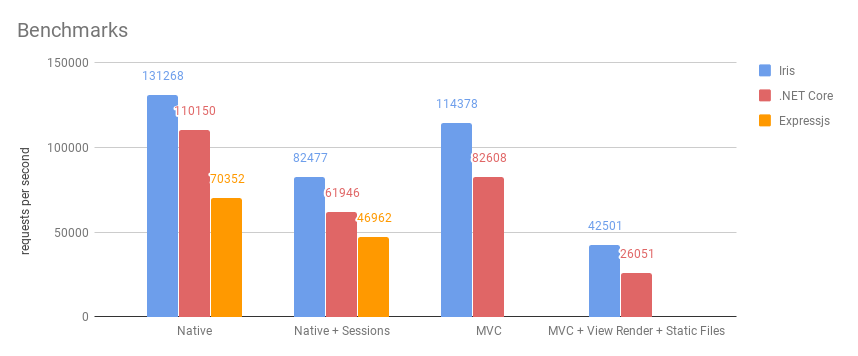
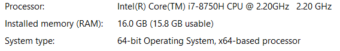

# Benchmarks: Monday, 22 October 2018



## Hardware



## Software

* OS: Microsoft **Windows 10** [Version 1803 (OS Build 17134.345)]
* HTTP Benchmark Tool: https://github.com/codesenberg/bombardier, latest version **1.2.0**
* **Iris [Go]**: https://github.com/kataras/iris, latest version **11.0.0** built with [go1.11.1](https://golang.org)
* **.NET Core (both Kestrel & MVC) [C#]**: https://www.microsoft.com/net/core, latest version **2.1.5**
* **Node.js (express + throng) [Javascript]**: https://nodejs.org/, latest version **10.12.0**, express: https://github.com/expressjs/express latest version **4.16.4** and [throng](https://www.npmjs.com/package/throng) latest version **4.0.0**

## Results

* Throughput - `how much data transferred per second`.
* Reqs/sec (Requests Per Second in Average) - `the highest the better, important`.
* Latency - `the smallest the better, important`.
* Time To Complete - `the smallest the better, important`.

| Name | Throughput | Reqs/sec | Latency | Time To Complete | Total Requests |
|-------|:-----------|:--------|:-------------|---------|------|
| Iris | 24.41MB/s | **131268** | **0.95ms** | **7s** | 1000000 |
| .NET Core (Kestrel) | 19.95MB/s | 110150 | 1.13ms | 9s | 1000000 |
| Expressjs| 18.60MB/s | 70352 | 1.80ms | 14s | 1000000 |
| Iris with Sessions | 25.32MB/s | **82477** | **1.53ms** | **1m1s** | 5000000 |
| .NET Core (Kestrel) with Sessions | 28.45MB/s | 61946 | 2.06ms | 1m1s | 5000000 |
| Expressjs with Sessions | 12.81MB/s | 46962 | 2.53mss | 1m42s | 5000000 |
| Iris MVC | 21.27MB/s | **114378** | **1.09ms** | **43s** | 5000000 |
| .Net Core MVC | 18.19MB/s | 82608 | 1.51ms | 1m | 5000000 |
| Expressjs MVC | - | - | - | - | - |
| Iris MVC with Templates | 306.60MB/s | **42501** | **2.94ms** | **23s** | 1000000 |
| .Net Core MVC with Templates | 188.01MB/s | 26051 | 4.78ms | 38s | 1000000 |
| Expressjs MVC with Templates | - | - | - | - | - |

Go ahead and read the rest of the page to learn how you can reproduce the benchmarks. Don't be afraid! It's actually very easy, you can do things like that as well!

## Old results (August of 2017)

 **Go vs .NET Core in terms of HTTP performance (Sa, 19 August 2017)**

- https://medium.com/@kataras/go-vs-net-core-in-terms-of-http-performance-7535a61b67b8
- https://dev.to/kataras/go-vsnet-core-in-terms-of-http-performance

**Iris Go vs .NET Core Kestrel in terms of HTTP performance (Mo, 21 August 2017)** 

- https://medium.com/@kataras/iris-go-vs-net-core-kestrel-in-terms-of-http-performance-806195dc93d5

**Thank you all** for the 100% green feedback, have fun!

# .NET Core MVC vs Iris MVC

The first test will contain a simple application with a text response and the second will render templates + a layout.

## Simple

We will compare two identical things here, in terms of application, the expected response and the stability of their run times, so we will not try to put more things in the game like `JSON` or `XML` encoders and decoders, just a simple text message. To achieve a fair comparison we will use the MVC architecture pattern on both sides, Go and .NET Core.

### .NET Core MVC

```bash
$ cd netcore-mvc
$ dotnet run --urls=http://localhost:5000 -c Release
Hosting environment: Production
Content root path: C:\mygopath\src\github.com\kataras\iris\_benchmarks\netcore-mvc
Now listening on: http://localhost:5000
Application started. Press Ctrl+C to shut down.
```

```bash
$ bombardier -c 125 -n 5000000 http://localhost:5000/api/values/5
Bombarding http://localhost:5000/api/values/5 with 5000000 request(s) using 125 connection(s)
 5000000 / 5000000 [=====================================================================================] 100.00% 1m0s
Done!
Statistics        Avg      Stdev        Max
  Reqs/sec     82608.44    4072.64   96896.66
  Latency        1.51ms   255.49us   235.36ms
  HTTP codes:
    1xx - 0, 2xx - 5000000, 3xx - 0, 4xx - 0, 5xx - 0
    others - 0
  Throughput:    18.19MB/s
```

### Iris MVC

```bash
$ cd iris-mvc
$ go run main.go
Now listening on: http://localhost:5000
Application started. Press CTRL+C to shut down.
```

```bash
$ bombardier -c 125 -n 5000000 http://localhost:5000/api/values/5
Bombarding http://localhost:5000/api/values/5 with 5000000 request(s) using 125 connection(s)
 5000000 / 5000000 [======================================================================================] 100.00% 43s
Done!
Statistics        Avg      Stdev        Max
  Reqs/sec    114378.40    5080.77  135410.87
  Latency        1.09ms    26.25us    19.92ms
  HTTP codes:
    1xx - 0, 2xx - 5000000, 3xx - 0, 4xx - 0, 5xx - 0
    others - 0
  Throughput:    21.27MB/s
```

Click [here](screens) to navigate to the screenshots.

### Summary

* Time to complete the `5000000 requests` - smaller is better.
* Reqs/sec - bigger is better.
* Latency - smaller is better
* Throughput - bigger is better.
* Memory usage - smaller is better.
* LOC (Lines Of Code) - smaller is better.

.NET Core MVC Application, written using 86 lines of code, ran for **1 minute** serving **82608.44** requests per second within **1.51ms** latency in average and **235.36ms** max, the memory usage of all these was ~123MB (without the dotnet host).

Iris MVC Application, written using 27 lines of code, ran for **43 seconds** serving **114378.40** requests per second within **1.09ms** latency in average and **19.92ms** max, the memory usage of all these was ~12MB.

#### Update: 20 August 2017 and benchmarks re-ran at 22 October 2018

As [Josh Clark](https://twitter.com/clarkis117) and [Scott Hanselman‏](https://twitter.com/shanselman)‏ pointed out [on this status](https://twitter.com/shanselman/status/899005786826788865), on .NET Core MVC `Startup.cs` file the line with `services.AddMvc();` can be replaced with `services.AddMvcCore();`. I followed their helpful instructions and re-run the benchmarks. The article now contains the latest benchmark output for the .NET Core application with the change both Josh and Scott noted.

The twitter conversation: https://twitter.com/MakisMaropoulos/status/899113215895982080

## MVC + Templates

Let’s run one more benchmark, spawn `1000000 requests` but this time we expect HTML generated by templates via the view engine.

### .NET Core MVC with Templates

```bash
$ cd netcore-mvc-templates
$ dotnet run --urls=http://localhost:5000 -c Release
Hosting environment: Production
Content root path: C:\mygopath\src\github.com\kataras\iris\_benchmarks\netcore-mvc-templates
Now listening on: http://localhost:5000
Application started. Press Ctrl+C to shut down.
```

```bash
$ bombardier -c 125 -n 1000000 http://localhost:5000
Bombarding http://localhost:5000 with 1000000 request(s) using 125 connection(s)
 1000000 / 1000000 [======================================================================================] 100.00% 38s
Done!
Statistics        Avg      Stdev        Max
  Reqs/sec     26051.53    3256.67   42363.32
  Latency        4.78ms     0.93ms   417.39ms
  HTTP codes:
    1xx - 0, 2xx - 1000000, 3xx - 0, 4xx - 0, 5xx - 0
    others - 0
  Throughput:   188.01MB/s
```

### Iris MVC with Templates

```bash
$ cd iris-mvc-templates
$ go run main.go
Now listening on: http://localhost:5000
Application started. Press CTRL+C to shut down.
```

```bash
$ bombardier -c 125 -n 1000000 http://localhost:5000
Bombarding http://localhost:5000 with 1000000 request(s) using 125 connection(s)
 1000000 / 1000000 [======================================================================================] 100.00% 23s
Done!
Statistics        Avg      Stdev        Max
  Reqs/sec     42501.30    1604.82   46023.80
  Latency        2.94ms    81.93us    24.93ms
  HTTP codes:
    1xx - 0, 2xx - 1000000, 3xx - 0, 4xx - 0, 5xx - 0
    others - 0
  Throughput:   306.60MB/s
```

### Summary

.NET Core MVC with Templates Application ran for **38 seconds** serving **26051.53** requests per second with **188.01MB/s** within **4.78ms** latency in average and **417.39ms** max, the memory usage of all these was ~193MB (without the dotnet host).

Iris MVC with Templates Application ran for **23 seconds** serving **42501.30** requests per second with **306.60MB/s** within **2.94ms** latency in average and **24.93ms** max, the memory usage of all these was ~17MB.

# .NET Core (Kestrel) vs Iris

This time we will compare the speed of the “low-level” .NET Core’s server implementation named Kestrel and Iris’ “low-level” handlers, we will test two simple applications, the first will be the same as our previous application but written using handlers and the second test will contain a single route which sets and gets a session value(string) based on a key(string).

## Simple

Spawn `1000000 requests` with 125 different "threads", targeting to a dynamic registered route path, responds with a simple "value" text.

### .NET Core (Kestrel)

```bash
$ cd netcore
$ dotnet run --urls=http://localhost:5000 -c Release
Hosting environment: Production
Content root path: C:\mygopath\src\github.com\kataras\iris\_benchmarks\netcore
Now listening on: http://localhost:5000
Application started. Press Ctrl+C to shut down.
```

```bash
$ bombardier -c 125 -n 1000000 http://localhost:5000/api/values/5
Bombarding http://localhost:5000/api/values/5 with 1000000 request(s) using 125 connection(s)
 1000000 / 1000000 [=======================================================================================] 100.00% 9s
Done!
Statistics        Avg      Stdev        Max
  Reqs/sec    110150.12    8195.73  122486.03
  Latency        1.13ms   178.98us    81.78ms
  HTTP codes:
    1xx - 0, 2xx - 1000000, 3xx - 0, 4xx - 0, 5xx - 0
    others - 0
  Throughput:    19.95MB/s
```

### Iris

```bash
$ cd iris
$ go run main.go
Now listening on: http://localhost:5000
Application started. Press CTRL+C to shut down.
```

```bash
$ bombardier -c 125 -n 1000000 http://localhost:5000/api/values/5
Bombarding http://localhost:5000/api/values/5 with 1000000 request(s) using 125 connection(s)
 1000000 / 1000000 [=======================================================================================] 100.00% 7s
Done!
Statistics        Avg      Stdev        Max
  Reqs/sec    131268.51    5757.43  141530.72
  Latency        0.95ms    62.10us    19.92ms
  HTTP codes:
    1xx - 0, 2xx - 1000000, 3xx - 0, 4xx - 0, 5xx - 0
    others - 0
  Throughput:    24.41MB/s
```

### Node.js (Express)

```bash
$ cd expressjs-throng
$ npm install
$ node app.js
Now listening on: http://localhost:5000
Application started. Press CTRL+C to shut down.
```

```bash
$ bombardier -c 125 -n 1000000 http://localhost:5000/api/values/5
Bombarding http://localhost:5000/api/values/5 with 1000000 request(s) using 125 connection(s)
 1000000 / 1000000 [======================================================================================] 100.00% 14s
Done!
Statistics        Avg      Stdev        Max
  Reqs/sec     70352.00   10947.26  115334.47
  Latency        1.80ms     1.39ms   206.45ms
  HTTP codes:
    1xx - 0, 2xx - 1000000, 3xx - 0, 4xx - 0, 5xx - 0
    others - 0
  Throughput:    18.60MB/s
```

### Summary

.NET Core (Kestrel) Application written using **63 code of lines** ran for **9 seconds** serving **110150.12** requests per second with **19.95MB/s** within **1.13ms** latency in average and **81.78ms** max.

Iris Application written using **14 code of lines** ran for **7 seconds** serving **131268.51** requests per second with **24.41MB/s** within **0.95ms** latency in average and **19.92ms** max.

Node.js (Express) Application written using **12 code of lines** ran for **14 seconds** serving **70352** requests per second with **18.60MB/s** within **1.80ms** latency in average and **206.45ms** max.

## Sessions

Spawn `5000000 requests` with 125 different "threads" targeting a static request path, sets and gets a session based on the name `"key"` and string value `"value"` and write that session value to the response stream.

### .NET Core (Kestrel) with Sessions

```bash
$ cd netcore-sessions
$ dotnet run --urls=http://localhost:5000 -c Release
Hosting environment: Production
Content root path: C:\mygopath\src\github.com\kataras\iris\_benchmarks\netcore-sessions
Now listening on: http://localhost:5000
Application started. Press Ctrl+C to shut down.
```

```bash
$ bombardier -c 125 -n 5000000 http://localhost:5000/setget
Bombarding http://localhost:5000/setget with 5000000 request(s) using 125 connection(s)
 5000000 / 5000000 [=====================================================================================] 100.00% 1m1s
Done!
Statistics        Avg      Stdev        Max
  Reqs/sec     61946.59   13164.30  100166.94
  Latency        2.06ms     2.42ms   781.91ms
  HTTP codes:
    1xx - 0, 2xx - 5000000, 3xx - 0, 4xx - 0, 5xx - 0
    others - 0
  Throughput:    28.45MB/s
```

### Iris with Sessions

```bash
$ cd iris-sessions
$ go run main.go
Now listening on: http://localhost:5000
Application started. Press CTRL+C to shut down.
```

```bash
$ bombardier -c 125 -n 5000000 http://localhost:5000/setget
Bombarding http://localhost:5000/setget with 5000000 request(s) using 125 connection(s)
 5000000 / 5000000 [=====================================================================================] 100.00% 1m1s
Done!
Statistics        Avg      Stdev        Max
  Reqs/sec     82477.76   29886.37  166399.36
  Latency        1.53ms   462.79us   286.23ms
  HTTP codes:
    1xx - 0, 2xx - 5000000, 3xx - 0, 4xx - 0, 5xx - 0
    others - 0
  Throughput:    25.32MB/s
```

### Node.js (Express) with Sessions

```bash
$ cd expressjs-throng-sessions
$ npm install
$ node app.js
Now listening on: http://localhost:5000
Application started. Press CTRL+C to shut down.
```

```bash
$ bombardier -c 125 -n 5000000 http://localhost:5000/setget
Bombarding http://localhost:5000/setget with 5000000 request(s) using 125 connection(s)
 5000000 / 5000000 [====================================================================================] 100.00% 1m42s
Done!
Statistics        Avg      Stdev        Max
  Reqs/sec     46962.17   10028.21  104302.48
  Latency        2.53ms     1.45ms   368.01ms
  HTTP codes:
    1xx - 0, 2xx - 5000000, 3xx - 0, 4xx - 0, 5xx - 0
    others - 0
  Throughput:    12.81MB/s
```

### Summary

.NET Core with Sessions Application ran for **1 minute and 1 second** serving **61946.59** requests per second with **28.45MB/s** within **2.06ms** latency in average and **781.91ms** max.

Iris with Sessions Application ran for **1 minute and 1 second** serving **82477.76** requests per second with **25.32MB/s** within **1.53ms** latency in average and **286.23ms** max.

Node.js (Express) with Sessions Application ran for **1 minute and 42 seconds** serving **46962.17** requests per second with **12.81MB/s** within **2.53ms** latency in average and **368.01ms** max.

> Click [here](screens) to navigate to the screenshots.