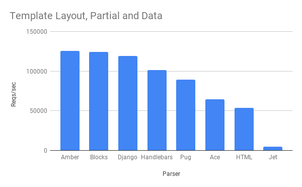

# View Engine Benchmarks

Benchmark between all 7 supported template parsers.

Ace and Pug parsers minifies the template before render. So, to have a fair benchmark, we must make sure that the byte amount of the total response body is exactly the same across all. Therefore, all other template files are minified too.



> Last updated: Mar 17, 2023 at 10:31am (UTC)

## System

|    |    |
|----|:---|
| Processor | 12th Gen Intel(R) Core(TM) i7-12700H |
| RAM | 15.68 GB |
| OS | Microsoft Windows 11 Pro |
| [Bombardier](https://github.com/codesenberg/bombardier) | v1.2.4 |
| [Go](https://golang.org) | go1.20.2 |
| [Node.js](https://nodejs.org/) | v19.5.0 |

## Terminology

**Name** is the name of the framework(or router) used under a particular test.

**Reqs/sec** is the avg number of total requests could be processed per second (the higher the better).

**Latency** is the amount of time it takes from when a request is made by the client to the time it takes for the response to get back to that client (the smaller the better).

**Throughput** is the rate of production or the rate at which data are transferred (the higher the better, it depends from response length (body + headers).

**Time To Complete** is the total time (in seconds) the test completed (the smaller the better).

## Results

### Test:Template Layout, Partial and Data

📖 Fires 1000000 requests with 125 concurrent clients. It receives HTML response. The server handler sets some template **data** and renders a template file which consists of a **layout** and a **partial** footer.

| Name | Language | Reqs/sec | Latency | Throughput | Time To Complete |
|------|:---------|:---------|:--------|:-----------|:-----------------|
| [Jet](./jet) | Go |248957 |500.81us |88.26MB |4.02s |
| [Blocks](./blocks) | Go |238854 |521.76us |84.74MB |4.19s |
| [Pug](./pug) | Go |238153 |523.74us |85.07MB |4.20s |
| [Django](./django) | Go |224448 |555.40us |79.61MB |4.46s |
| [Handlebars](./handlebars) | Go |197267 |631.99us |69.96MB |5.07s |
| [Ace](./ace) | Go |157415 |792.53us |55.83MB |6.35s |
| [HTML](./html) | Go |120811 |1.03ms |42.82MB |8.29s |

## How to Run

```sh
$ go install github.com/kataras/server-benchmarks@master
$ go install github.com/codesenberg/bombardier@master
$ server-benchmarks --wait-run=3s -o ./results
```
