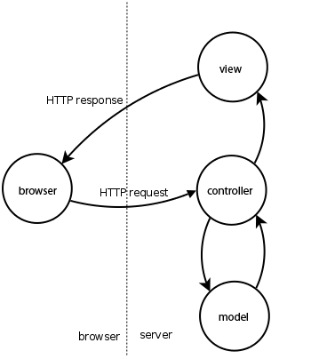

# 示例

请先学习如何使用 [net/http](https://golang.org/pkg/net/http/) 

这里包含大部分 [iris](https://github.com/kataras/iris) 网络微框架的简单使用示例

这些示例不一定是最优解，但涵盖了 Iris 的大部分重要功能。

### 概览

- [Hello world!](hello-world/main.go)
- [Hello WebAssemply!](webassembly/basic/main.go) **NEW**
- [基础](overview/main.go)
- [教程: 在线人数](tutorial/online-visitors/main.go)
- [教程: 一个“待完成”MVC Application基于Iris和Vue.js](https://hackernoon.com/a-todo-mvc-application-using-iris-and-vue-js-5019ff870064)
- [教程: 结合 BoltDB 生成短网址](https://medium.com/@kataras/a-url-shortener-service-using-go-iris-and-bolt-4182f0b00ae7)
- [教程: 用安卓设备搭建服务器 (**MUST**)](https://twitter.com/ThePracticalDev/status/892022594031017988)
- [POC: 把中等项目"Parrot"从原生转换到Iris](https://github.com/iris-contrib/parrot)
- [POC: 同构react/hot reloadable/redux/css-modules的起始工具包](https://github.com/kataras/iris-starter-kit)
- [教程: DropzoneJS 上传](tutorial/dropzonejs)
- [教程: Caddy 服务器使用](tutorial/caddy)
- [教程: Iris + MongoDB](https://medium.com/go-language/iris-go-framework-mongodb-552e349eab9c)
- [教程: Apache Kafka的API](tutorial/api-for-apache-kafka) **NEW**

### 目录结构

Iris 是个底层框架, 对 MVC 模式有很好的支持，但不限制文件夹结构，你可以随意组织你的代码。

如何组织代码取决于你的需求. 我们无法告诉你如何设计程序，但你可以仔细查看下面的示例，也许有些片段可以直接放到你的程序里。

- [引导模式架构](structuring/bootstrap)
- [MVC 存储层与服务层](structuring/mvc-plus-repository-and-service-layers)
- [登录演示 (MVC 使用独立包组织)](structuring/login-mvc-single-responsibility-package)
- [登录演示 (MVC 数据模型, 数据源, 存储 和 服务层)](structuring/login-mvc)

### HTTP 监听

- [基础用法](http-listening/listen-addr/main.go)
    * [忽略错误信息](http-listening/listen-addr/omit-server-errors/main.go)
- [UNIX socket文件](http-listening/listen-unix/main.go)
- [TLS](http-listening/listen-tls/main.go)
- [Letsencrypt (自动认证)](http-listening/listen-letsencrypt/main.go)
- [进程关闭通知](http-listening/notify-on-shutdown/main.go)
- 自定义 TCP 监听器
    * [通用 net.Listener](http-listening/custom-listener/main.go)
    * [unix系统的SO_REUSEPORT](http-listening/custom-listener/unix-reuseport/main.go)
- 自定义 HTTP 服务  
    * [简单方式](http-listening/custom-httpserver/easy-way/main.go)
    * [标准方式](http-listening/custom-httpserver/std-way/main.go)
    * [多个服务示例](http-listening/custom-httpserver/multi/main.go)
- 优雅关闭
    * [使用 `RegisterOnInterrupt`](http-listening/graceful-shutdown/default-notifier/main.go)
    * [自定义通知](http-listening/graceful-shutdown/custom-notifier/main.go)

### 配置

- [基本配置方式](configuration/functional/main.go)
- [Struct 方式配置](configuration/from-configuration-structure/main.go)
- [导入 YAML 配置文件](configuration/from-yaml-file/main.go)
    * [多实例共享配置](configuration/from-yaml-file/shared-configuration/main.go)
- [导入 TOML 配置文件](configuration/from-toml-file/main.go)

### 路由、路由分组、路径动态参数、路由参数处理宏 、 自定义上下文

* `app.Get("{userid:int min(1)}", myHandler)`
* `app.Post("{asset:path}", myHandler)`
* `app.Put("{custom:string regexp([a-z]+)}", myHandler)`

提示: 不同于其他路由处理, iris 路由可以处理以下各种情况:
```go
// 匹配静态前缀 "/assets/" 的各种请求
app.Get("/assets/{asset:path}", assetsWildcardHandler)

// 只匹配 GET "/"
app.Get("/", indexHandler)
// 只匹配 GET "/about"
app.Get("/about", aboutHandler)

// 匹配前缀为 "/profile/" 的所有 GET 请求
// 接着是其余部分的匹配
app.Get("/profile/{username:string}", userHandler)
// 只匹配 "/profile/me" GET 请求，
// 这和 /profile/{username:string} 
// 或跟通配符 {root:path} 不冲突
app.Get("/profile/me", userHandler)

// 匹配所有前缀为 /users/ 的 GET 请求
// 参数为数字，且 >= 1
app.Get("/user/{userid:int min(1)}", getUserHandler)
// 匹配所有前缀为 /users/ 的 DELETE 请求
// 参数为数字，且 >= 1
app.Delete("/user/{userid:int min(1)}", deleteUserHandler)

// 匹配所有 GET 请求，除了 "/", "/about", 或其他以 "/assets/" 开头
// 因为它不会与其他路线冲突。
app.Get("{root:path}", rootWildcardHandler)
```

可以浏览以下示例，以便更好理解

- [概览](routing/overview/main.go)
- [基本使用](routing/basic/main.go)
- [控制器](mvc)
- [自定义 HTTP 错误](routing/http-errors/main.go)
- [动态路径](routing/dynamic-path/main.go)
    * [根级通配符路径](routing/dynamic-path/root-wildcard/main.go)
- [编写你自己的参数类型](routing/macros/main.go) **NEW**
- [反向路由](routing/reverse/main.go)
- [自定义路由(高层级)](routing/custom-high-level-router/main.go) **NEW**
- [自定义包装](routing/custom-wrapper/main.go)
- 自定义上下文
    * [方法重写](routing/custom-context/method-overriding/main.go)
    * [新实现方式](routing/custom-context/new-implementation/main.go)
- [路由状态](routing/route-state/main.go)
- [中间件定义](routing/writing-a-middleware)
    * [路由前](routing/writing-a-middleware/per-route/main.go)
    * [全局](routing/writing-a-middleware/globally/main.go)

### hero (输出的一种高效包装模式)

- [基础](hero/basic/main.go)
- [概览](hero/overview)
- [Sessions](hero/sessions) **NEW**
- [另一种依赖注入的例子和通常的较好实践](hero/smart-contract/main.go) **NEW**

### MVC 模式



Iris **对 MVC (Model View Controller) 有一流的支持**, 在 Go 社区里是独一无二的。

Iris 支持快速的请求数据，模型，持久性数据和绑定。

**特点**

支持所有的HTTP访问方式，例如，如果想要处理`GET`请求，那么控制器应该有一个叫做`Get()`的函数
你可以在同一个控制器上面定义不止一个请求处理函数(method function).

通过`BeforeActivation`对每个控制器自定义事件回调，使自定义控制器的结构方法(struct's methods)处理自定义路径(甚至是包含参数是正则表达式的路径)，例如：

```go
import (
    "github.com/kataras/iris"
    "github.com/kataras/iris/mvc"
)

func main() {
    app := iris.New()
    mvc.Configure(app.Party("/root"), myMVC)
    app.Run(iris.Addr(":8080"))
}

func myMVC(app *mvc.Application) {
    // app.Register(...)
    // app.Router.Use/UseGlobal/Done(...)
    app.Handle(new(MyController))
}

type MyController struct {}

func (m *MyController) BeforeActivation(b mvc.BeforeActivation) {
    // b.Dependencies().Add/Remove
    // b.Router().Use/UseGlobal/Done // 以及任何你已经知道的标准API调用

    // 1-> 方法
    // 2-> 路径
    // 3-> 被解释成handler的控制器函数名称
    // 4-> 在MyCustomHandler之前需要执行的其他handler
    b.Handle("GET", "/something/{id:long}", "MyCustomHandler", anyMiddleware...)
}

// GET: http://localhost:8080/root
func (m *MyController) Get() string { return "Hey" }

// GET: http://localhost:8080/root/something/{id:long}
func (m *MyController) MyCustomHandler(id int64) string { return "MyCustomHandler says Hey" }
```

通过定义依赖项服务或者有一个`单一(Singleton)`控制器范畴来持久化你控制器结构中的数据(多次请求间共享的数据)
  
在控制器间共享依赖或者把他们注册到上层MVC应用，以及
在一个控制器内部可以修改每一个控制器在`BeforeActivation`可选事件回调上的依赖项的能力。
即 `func(c *MyController) BeforeActivation(b mvc.BeforeActivation) { b.Dependencies().Add/Remove(...) }`.

访问`Context`作为一个控制器的域(field)（不需要手动绑定）即`Ctx iris.Context`，或者通过一个方法的输入参数，即`func(ctx iris.Context, otherArguments...)`。  

你控制器结构中的模型（在模型函数中设置并且由视图来渲染）
你可以通过一个控制器的方法来返回模型或者设置一个请求生命周期的域

并且在同一个生命周期中把这个域返回给另一个方法。

正如你之前所熟知的流程，mvc应用程序有它自己的以标准iris API `iris/router.Party`作为类型的`路由(router)`。
`控制器`可以被注册到任意`集合(party)`，包括子域名，这个集合会像所预料那样开始完成处理器工作。

可额外调用`BeginRequest(ctx)`在任何方法被执行前进行初始化，对于调用中间层(middlewares)或者使用同一组数据的多个方法而言十分有效

同样可调用`EndRequest(ctx)`在任何方法执行后做完成工作(finalization)

递归继承参考我们`mvc.SessionController`的例子，它以`Session *sessions.Session`和`Manager *sessions.Sessions`作为嵌入域，由它的`BeginRequest`来传递，看[这里](https://github.com/kataras/iris/blob/master/mvc/session_controller.go)  

这只是一个例子，你可以使用`sessions.Session`，它作为一个MVC应用的动态依赖从管理者的`Start`返回，即
`mvcApp.Register(sessions.New(sessions.Config{Cookie: "iris_session_id"}).Start)`.  

通过控制器方法的输入参数来访问动态路径参数，不需要绑定。
当你需要使用Iris的默认语法从一个控制器里来解析一个handler，你需要在这个方法前加上`By`， 大写表示一个新的子路径。例如：

如果是 `mvc.New(app.Party("/user")).Handle(new(user.Controller))`

- `func(*Controller) Get()` - `GET:/user`.
- `func(*Controller) Post()` - `POST:/user`.
- `func(*Controller) GetLogin()` - `GET:/user/login`
- `func(*Controller) PostLogin()` - `POST:/user/login`
- `func(*Controller) GetProfileFollowers()` - `GET:/user/profile/followers`
- `func(*Controller) PostProfileFollowers()` - `POST:/user/profile/followers`
- `func(*Controller) GetBy(id int64)` - `GET:/user/{param:long}`
- `func(*Controller) PostBy(id int64)` - `POST:/user/{param:long}`

如果是 `mvc.New(app.Party("/profile")).Handle(new(profile.Controller))`

- `func(*Controller) GetBy(username string)` - `GET:/profile/{param:string}`

如果是 `mvc.New(app.Party("/assets")).Handle(new(file.Controller))`

- `func(*Controller) GetByWildard(path string)` - `GET:/assets/{param:path}`

    支持的函数接收者类型是：int, int64, bool and string。

可以通过输出参数来响应，即

```go
func(c *ExampleController) Get() string |
                                (string, string) |
                                (string, int) |
                                int |
                                (int, string) |
                                (string, error) |
                                error |
                                (int, error) |
                                (any, bool) |
                                (customStruct, error) |
                                customStruct |
                                (customStruct, int) |
                                (customStruct, string) |
                                mvc.Result or (mvc.Result, error)
```

其中[mvc.Result](https://github.com/kataras/iris/blob/master/mvc/func_result.go)是一个仅包含`Dispatch(ctx iris.Context)`的接口

## Iris MVC 模式代码复用

通过创建互相独立的组建，开发者可以简单快捷地在别的应用里面复用组建。 一个应用同样的（或相似的）视图使用不同的数据可以被重构给另一个应用，因为视图仅仅处理数据怎么展示给用户。

如果你是一个新的web后端开发者，请先阅读MVC架构模式，一个不错的入门是[wikipedia article](https://en.wikipedia.org/wiki/Model%E2%80%93view%E2%80%93controller).

参考下面的示例

- [Hello world](mvc/hello-world/main.go) **UPDATED**
- [Session Controller](mvc/session-controller/main.go) **UPDATED**
- [Overview - Plus Repository and Service layers](mvc/overview) **UPDATED**
- [Login showcase - Plus Repository and Service layers](mvc/login) **UPDATED**
- [Singleton](mvc/singleton) **NEW**
- [Websocket Controller](mvc/websocket) **NEW**
- [Register Middleware](mvc/middleware) **NEW**
- [Vue.js Todo MVC](tutorial/vuejs-todo-mvc) **NEW**

### 子域名

- [单域名](subdomains/single/main.go)
- [多域名](subdomains/multi/main.go)
- [通配符](subdomains/wildcard/main.go)
- [WWW](subdomains/www/main.go)
- [快速跳转](subdomains/redirect/main.go)

### 改造 `http.Handler/HandlerFunc`

- [From func(w http.ResponseWriter, r *http.Request, next http.HandlerFunc)](convert-handlers/negroni-like/main.go)
- [From http.Handler or http.HandlerFunc](convert-handlers/nethttp/main.go)
- [From func(http.HandlerFunc) http.HandlerFunc](convert-handlers/real-usecase-raven/writing-middleware/main.go)

### 视图

| 模板引擎 | 调用声明 |
| -----------|-------------|
| template/html | `iris.HTML(...)`       |
| django        | `iris.Django(...)`     |
| handlebars    | `iris.Handlebars(...)` |
| amber         | `iris.Amber(...)`      |
| pug(jade)     | `iris.Pug(...)`        |

- [Overview概览](view/overview/main.go)
- [Hi](view/template_html_0/main.go)
- [A simple Layout简单层](view/template_html_1/main.go)
- [Layouts: `yield` and `render` tmpl funcs 视图层`生产`以及`渲染`模版函数](view/template_html_2/main.go)
- [The `urlpath` tmpl func`urlpath`模版函数](view/template_html_3/main.go)
- [The `url` tmpl func`url`模版函数](view/template_html_4/main.go)
- [Inject Data Between Handlers在处理器间注入数据](view/context-view-data/main.go)
- [Embedding Templates Into App Executable File在应用程序可执行文件中嵌入模版](view/embedding-templates-into-app/main.go)
- [Write to a custom `io.Writer`自定义`io.Writer`](view/write-to)
- [Greeting with `Pug (Jade)`使用`Pug (Jade)`](view/template_pug_0)
- [`Pug (Jade) Actions`](view/template_pug_1)
- [`Pug (Jade) Includes`](view/template_pug_2)
- [`Pug (Jade) Extends`](view/template_pug_3)

You can serve [quicktemplate](https://github.com/valyala/quicktemplate) and [hero templates](https://github.com/shiyanhui/hero/hero) files too, simply by using the `context#ResponseWriter`, take a look at the [http_responsewriter/quicktemplate](http_responsewriter/quicktemplate) and [http_responsewriter/herotemplate](http_responsewriter/herotemplate) examples.
只要使用`context#ResponseWriter`，你可以服务[quicktemplate](https://github.com/valyala/quicktemplate)和[hero templates](https://github.com/shiyanhui/hero/hero)文件。
看这the [http_responsewriter/quicktemplate](http_responsewriter/quicktemplate)和[http_responsewriter/herotemplate](http_responsewriter/herotemplate)的例子

### 认证

- [Basic Authentication](authentication/basicauth/main.go)
- [OAUth2](authentication/oauth2/main.go)
- [JWT](experimental-handlers/jwt/main.go)
- [Sessions](#sessions)

### 文件服务器

- [Favicon](file-server/favicon/main.go)
- [基础操作](file-server/basic/main.go)
- [把文件嵌入应用的可执行文件](file-server/embedding-files-into-app/main.go)
- [嵌入Gzip压缩的文件到可咨询文件](file-server/embedding-gziped-files-into-app/main.go) **NEW**
- [上传/(强制)下载文件](file-server/send-files/main.go)
- 单页面应用(Single Page Applications)
    * [单页面应用](file-server/single-page-application/basic/main.go)
    * [嵌入式(embedded)单页面应用](file-server/single-page-application/embedded-single-page-application/main.go)
    * [使用额外路由的嵌入式单页面应用](file-server/single-page-application/embedded-single-page-application-with-other-routes/main.go)

### 如何读取`context.Request() *http.Request`

- [读取JSON](http_request/read-json/main.go)
- [读取XML](http_request/read-xml/main.go)
- [读取Form](http_request/read-form/main.go)
- [读取每个类型的自定义结果Custom per type](http_request/read-custom-per-type/main.go)
- [通过Unmarshaler读取Custom](http_request/read-custom-via-unmarshaler/main.go)
- [上传/读取文件Upload/Read File](http_request/upload-file/main.go)
- [简单上传多个文件Upload multiple files with an easy way](http_request/upload-files/main.go)

> The `context.Request()` returns the same *http.Request you already know, these examples show some places where the  Context uses this object. Besides that you can use it as you did before iris.
> `context.Request()`返回你已知的同一*http.Request， 这些例子给出了Context使用这个对象的地方。 除此以外你可以在使用iris之前那样子使用它

### 如何写入`context.ResponseWriter() http.ResponseWriter`

- [`valyala/quicktemplate`模版](http_responsewriter/quicktemplate)
- [`shiyanhui/hero`模版](http_responsewriter/herotemplate)
- [Text, Markdown, HTML, JSON, JSONP, XML, Binary](http_responsewriter/write-rest/main.go)
- [写入Gzip压缩](http_responsewriter/write-gzip/main.go)
- [流输出Stream Writer](http_responsewriter/stream-writer/main.go)
- [数据传递Transactions](http_responsewriter/transactions/main.go)
- [SSE](http_responsewriter/sse/main.go) **NEW**
- [SSE (third-party package usage for server sent events第三方库SSE)](http_responsewriter/sse-third-party/main.go)

> The `context/context#ResponseWriter()` returns an enchament version of a http.ResponseWriter, these examples show some places where the Context uses this object. Besides that you can use it as you did before iris.

> `context.Request()`返回了一个http.ResponseWriter的迷醉(魔幻)版本， 这些例子给出了Context使用这个对象的地方。 除此以外你可以在使用iris之前那样子使用它

### ORM

- [使用 xorm(Mysql, MyMysql, Postgres, Tidb, **SQLite**, MsSql, MsSql, Oracle)](orm/xorm/main.go)

### 其他

- [请求记录器](http_request/request-logger/main.go)
    * [将请求记录到文件](http_request/request-logger/request-logger-file/main.go)
- [本地化和多语言支持](miscellaneous/i18n/main.go)
- [恢复](miscellaneous/recover/main.go)
- [性能报告Profiling (pprof)](miscellaneous/pprof/main.go)
- [内部文件记录Internal Application File Logger](miscellaneous/file-logger/main.go)
- [Google验证码Google reCAPTCHA](miscellaneous/recaptcha/main.go) 

### 试验性质处理器

- [Casbin wrapper](experimental-handlers/casbin/wrapper/main.go)
- [Casbin middleware](experimental-handlers/casbin/middleware/main.go)
- [Cloudwatch](experimental-handlers/cloudwatch/simple/main.go)
- [CORS](experimental-handlers/cors/simple/main.go)
- [JWT](experimental-handlers/jwt/main.go)
- [Newrelic](experimental-handlers/newrelic/simple/main.go)
- [Prometheus](experimental-handlers/prometheus/simple/main.go)
- [安全](experimental-handlers/secure/simple/main.go)
- [Tollboothic](experimental-handlers/tollboothic/limit-handler/main.go)
- [跨站点伪造请求（CSRF）防护](experimental-handlers/csrf/main.go)

#### 更多

https://github.com/kataras/iris/tree/master/middleware#third-party-handlers

### 自动 API 文档

- [yaag](apidoc/yaag/main.go)

### 测试

The `httptest` package is your way for end-to-end HTTP testing, it uses the httpexpect library created by our friend, [gavv](https://github.com/gavv).
`httptest`包是你用于端对端HTTP测试的，它使用我们朋友[gavv](https://github.com/gavv)创建的httpexpect库

[例子](testing/httptest/main_test.go)

### 缓存

Iris 独立缓存包 [package](https://github.com/kataras/iris/tree/master/cache).

- [简单示例](cache/simple/main.go)
- [客户端 (304)](cache/client-side/main.go) - context 方法

> 可以随意使用自定义的缓存包。

### Cookies

- [基础](cookies/basic/main.go)
- [加密/解密 (安全cookie)](cookies/securecookie/main.go)

### Sessions

Iris session 管理独立包 [package](https://github.com/kataras/iris/tree/master/sessions).

- [概览](sessions/overview/main.go)
- [独立使用](sessions/standalone/main.go)
- [安全cookie](sessions/securecookie/main.go)
- [临时消息](sessions/flash-messages/main.go)
- [数据库](sessions/database)
    * [Badger](sessions/database/badger/main.go)
    * [Redis](sessions/database/redis/main.go)

> 可以随意使用自定义的 Session 管理包。

### Websockets

iris websocket库依赖于它自己的[包](https://github.com/kataras/iris/tree/master/websocket).  

设计这个包的目的是处理原始websockets，虽然它的API和著名的[socket.io](https://socket.io)很像。我最近读了一片文章，并且对我
决定给iris设计一个**快速的**websocket**限定**包并且不是一个向后传递类socket.io的包。你可以阅读这个链接里的文章https://medium.com/@ivanderbyl/why-you-don-t-need-socket-io-6848f1c871cd。

- [聊天](websocket/chat/main.go)
- [Chat with Iris Go Client Side](websocket/go-client) **NEW**
    * [Server](websocket/go-client/server/main.go)
    * [Client](websocket/go-client/client/main.go)
- [原生消息](websocket/native-messages/main.go)
- [连接列表](websocket/connectionlist/main.go)
- [TLS支持](websocket/secure/main.go)
- [自定义原始Go客户端](websocket/custom-go-client/main.go)
- [第三方socket.io](websocket/third-party-socketio/main.go)

> 如果你愿意，你可以自由使用你自己喜欢的websockets包。

### Typescript 自动化工具

Typescript 自动化工具独立库： [https://github.com/kataras/iris/tree/master/typescript](https://github.com/kataras/iris/tree/master/typescript) **包含相关示例**

### 大兄弟

进一步学习可通过 [godocs](https://godoc.org/github.com/kataras/iris) 和 https://docs.iris-go.com

不要忘记点赞 [star or watch](https://github.com/kataras/iris/stargazers) 这个项目会一直跟进最新趋势。
