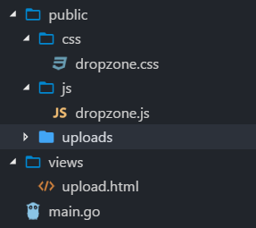
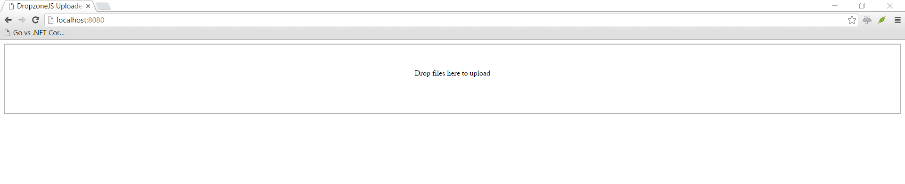

# Articles

* [How to build a file upload form using DropzoneJS and Go](https://hackernoon.com/how-to-build-a-file-upload-form-using-dropzonejs-and-go-8fb9f258a991)
* [How to display existing files on server using DropzoneJS and Go](https://hackernoon.com/how-to-display-existing-files-on-server-using-dropzonejs-and-go-53e24b57ba19)

# Content

This is the part 1 of 2 in DropzoneJS + Go series.

- [Part 1: How to build a file upload form](README.md)
- [Part 2: How to display existing files on server](README_PART2.md)

# DropzoneJS + Go: How to build a file upload form

[DropzoneJS](https://github.com/enyo/dropzone) is an open source library that provides drag'n'drop file uploads with image previews. It is a great JavaScript library which actually does not even rely on JQuery. 
In this tutorial, we are building a multiple file upload form using DropzoneJS, and the backend will be handled by Go and [Iris](https://iris-go.com).

## Table Of Content

- [Preparation](#preparation)
- [Work with DropzoneJS](#work-with-dropzonejs)
- [Work with Go](#work-with-go)

## Preparation

1. Download [Go(Golang)](https://golang.org/dl), setup your computer as shown there and continue to 2.
2. Install [Iris](https://github.com/kataras/iris); open a terminal and execute `go get -u github.com/kataras/iris`
3. Download DropzoneJS from [this URL](https://raw.githubusercontent.com/enyo/dropzone/master/dist/dropzone.js). DropzoneJS does not rely on JQuery, you will not have to worry that, upgrading JQuery version breaks your application.
4. Download dropzone.css from [this URL](https://raw.githubusercontent.com/enyo/dropzone/master/dist/dropzone.css), if you want some already made css.
5. Create a folder "./public/uploads", this is for storing uploaded files.
6. Create a file "./views/upload.html", this is for the front form page.
7. Create a file "./main.go", this is for handling backend file upload process.

Your folder&file structure should look like this after the preparation:



## Work with DropzoneJS

Open file "./views/upload.html" and let us create a DropzoneJs form.

Copy the content below to "./views/upload.html" and we will go through each line of code individually.

```html
<!-- /views/upload.html -->
<html>

<head>
    <title>DropzoneJS Uploader</title>

    <!-- 1 -->
    <link href="/public/css/dropzone.css" type="text/css" rel="stylesheet" />

    <!-- 2 -->
    <script src="/public/js/dropzone.js"></script>
</head>

<body>

    <!-- 3 -->
    <form action="/upload" method="POST" class="dropzone" id="my-dropzone">
        <div class="fallback">
            <input name="file" type="file" multiple />
            <input type="submit" value="Upload" />
        </div>
    </form>
</body>

</html>
```

1. Include the CSS Stylesheet.
2. Include DropzoneJS JavaScript library.
3. Create an upload form with css class "dropzone" and "action" is the route path "/upload". Note that we did create an input filed for fallback mode. This is all handled by DropzoneJS library itself. All we need to do is assign css class "dropzone" to the form. By default, DropzoneJS will find all forms with class "dropzone" and automatically attach itself to it.

## Work with Go

Now you have come to Last part of the tutorial. In this section, we will store files sent from DropzoneJS to the "./public/uploads" folder.

Open "main.go" and copy the code below:

```go
// main.go

package main

import (
    "os"
    "io"
    "strings"

    "github.com/kataras/iris/v12"
)

const uploadsDir = "./public/uploads/"

func main() {
    app := iris.New()

    // Register templates
    app.RegisterView(iris.HTML("./views", ".html"))

    // Make the /public route path to statically serve the ./public/... contents
    app.HandleDir("/public", iris.Dir("./public"))

    // Render the actual form
    // GET: http://localhost:8080
    app.Get("/", func(ctx iris.Context) {
        if err := ctx.View("upload.html"); err != nil {
		ctx.HTML("<h3>%s</h3>", err.Error())
		return
	}
    })

    // Upload the file to the server
    // POST: http://localhost:8080/upload
    app.Post("/upload", iris.LimitRequestBodySize(10<<20), func(ctx iris.Context) {
        // Get the file from the dropzone request
        file, info, err := ctx.FormFile("file")
        if err != nil {
            ctx.StatusCode(iris.StatusInternalServerError)
            ctx.Application().Logger().Warnf("Error while uploading: %v", err.Error())
            return
        }

        defer file.Close()
        fname := info.Filename

        // Create a file with the same name
        // assuming that you have a folder named 'uploads'
        out, err := os.OpenFile(uploadsDir+fname,
            os.O_WRONLY|os.O_CREATE, 0666)

        if err != nil {
            ctx.StatusCode(iris.StatusInternalServerError)
            ctx.Application().Logger().Warnf("Error while preparing the new file: %v", err.Error())
            return
        }
        defer out.Close()

        io.Copy(out, file)
    })

    // Start the server at http://localhost:8080
    app.Listen(":8080")
}
```

1. Create a new Iris app.
2. Register and load templates from the "views" folder.
3. Make the "/public" route path to statically serve the ./public/... folder's contents
4. Create a route to serve the upload form.
5. Create a route to handle the POST form data from the DropzoneJS' form 
6. Declare a variable for destination folder.
7. If file is sent to the page, store the file object to a temporary "file" variable.
8. Move uploaded file to destination based on the uploadsDir+uploaded file's name.

### Running the server

Open the terminal at the current project's folder and execute:

```bash
$ go run main.go
Now listening on: http://localhost:8080
Application started. Press CTRL+C to shut down.
```

Now go to browser, and navigate to http://localhost:8080, you should be able to see a page as below:


