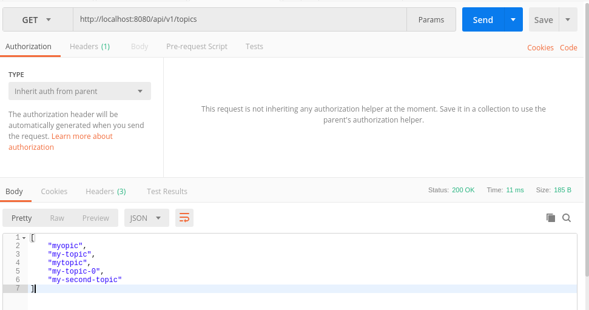

# Writing an API for Apache Kafka with Iris

Read the [code](main.go).

## Docker

1. Open [docker-compose.yml](docker-compose.yml) and replace `KAFKA_ADVERTISED_HOST_NAME` with your own local address
2. Install [Docker](https://www.docker.com/)
3. Execute the command below to start kafka stack and the go application:

```sh
$ docker-compose up
```

## Manually

Install & run Kafka and Zookeper locally and then:

```sh
go run main.go
```

## Screens





