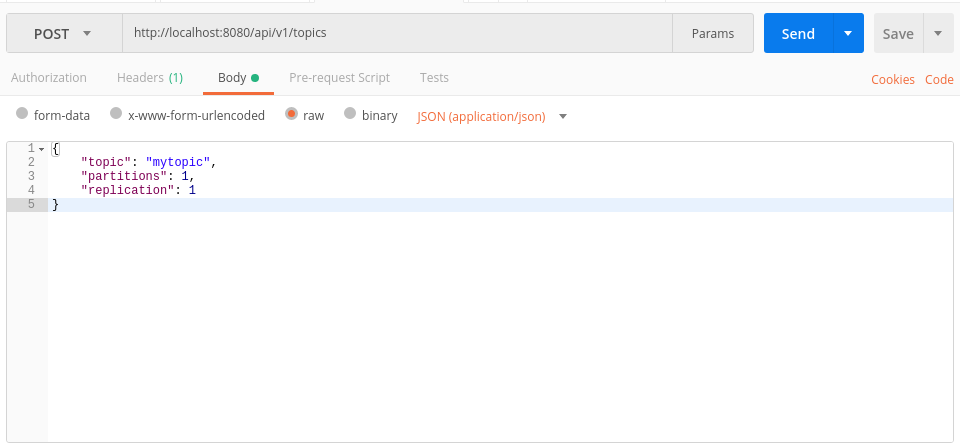
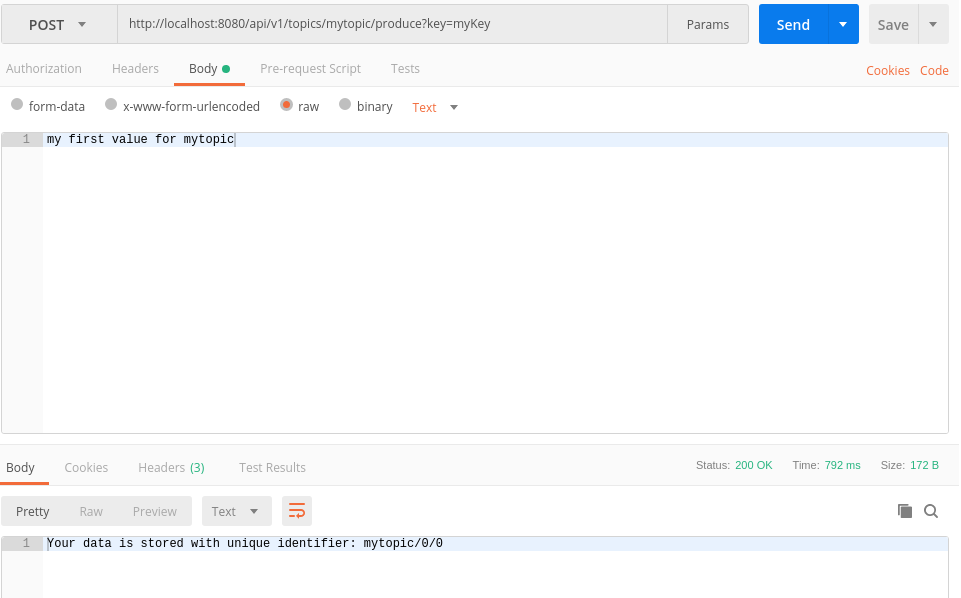
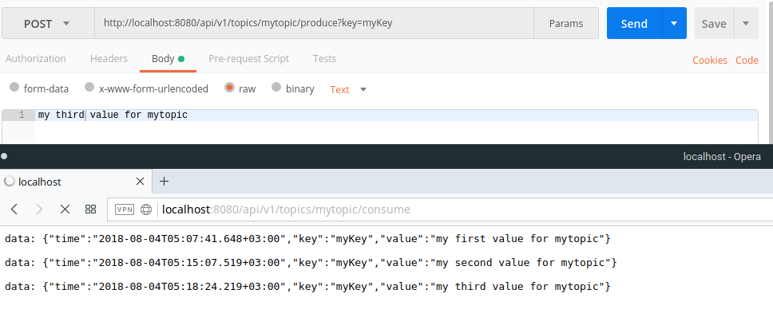

# Writing an API for Apache Kafka with Iris

Article is coming soon, follow and stay tuned

- <https://medium.com/@kataras>
- <https://dev.to/kataras>

Read [the fully functional example](src/main.go).

## Screens

