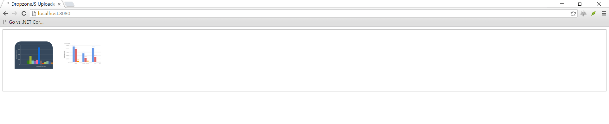

# Articles

* [How to build a file upload form using DropzoneJS and Go](https://hackernoon.com/how-to-build-a-file-upload-form-using-dropzonejs-and-go-8fb9f258a991)
* [How to display existing files on server using DropzoneJS and Go](https://hackernoon.com/how-to-display-existing-files-on-server-using-dropzonejs-and-go-53e24b57ba19)

# Content

This is the part 2 of 2 in DropzoneJS + Go series.

- [Part 1: How to build a file upload form](README.md)
- [Part 2: How to display existing files on server](README_PART2.md)

# DropzoneJS + Go: How to display existing files on server

In this tutorial, we will show you how to display existing files on the server when using DropzoneJS and Go. This tutorial is based on [How to build a file upload form using DropzoneJS and Go](README.md). Make sure you have read it before proceeding to content in this tutorial.

## Table Of Content

- [Preparation](#preparation)
- [Modify the Server side](#modify-the-server-side)
- [Modify the Client side](#modify-the-client-side)
- [References](#references)
- [The End](#the-end)

## Preparation

Install the go package "github.com/nfnt/resize" with `go get github.com/nfnt/resize`, we need it to create thumbnails.

In previous [tutorial](README.md). We have already set up a proper working DropzoneJs upload form. There is no additional file needed for this tutorial. What we need to do is to make some modifications to file below:

1. main.go
2. views/upload.html

Let us get started!

## Modify the Server side

In previous tutorial. All "/upload" does is to store uploaded files to the server directory "./public/uploads". So we need to add a piece of code to retrieve stored files' information (name and size), and return it in JSON format.

Copy the content below to "main.go". Read comments for details.

```go
// main.go

package main

import (
    "image/jpeg"
    "image/png"
    "io"
    "os"
    "path"
    "path/filepath"
    "strings"
    "sync"

    "github.com/kataras/iris"

    "github.com/nfnt/resize" // $ go get -u github.com/nfnt/resize
)

const uploadsDir = "./public/uploads/"

type uploadedFile struct {
    // {name: "", size: } are the dropzone's only requirements.
    Name string `json:"name"`
    Size int64  `json:"size"`
}

type uploadedFiles struct {
    dir   string
    items []uploadedFile
    mu    sync.RWMutex // slices are safe but RWMutex is a good practise for you.
}

// scan the ./public/uploads folder for any files
// add them to a new  uploadedFiles list.
func scanUploads(dir string) *uploadedFiles {
    f := new(uploadedFiles)

    lindex := dir[len(dir)-1]
    if lindex != os.PathSeparator && lindex != '/' {
        dir += string(os.PathSeparator)
    }

    // create directories if necessary
    // and if, then return empty uploaded files; skipping the scan.
    if err := os.MkdirAll(dir, os.FileMode(0666)); err != nil {
        return f
    }

    // otherwise scan the given "dir" for files.
    f.scan(dir)
    return f
}

func (f *uploadedFiles) scan(dir string) {
    f.dir = dir
    filepath.Walk(dir, func(path string, info os.FileInfo, err error) error {

        // if it's directory or a thumbnail we saved earlier, skip it.
        if info.IsDir() || strings.HasPrefix(info.Name(), "thumbnail_") {
            return nil
        }

        f.add(info.Name(), info.Size())
        return nil
    })
}

// add the file's Name and Size to the uploadedFiles memory list
func (f *uploadedFiles) add(name string, size int64) uploadedFile {
    uf := uploadedFile{
        Name: name,
        Size: size,
    }
    f.mu.Lock()
    f.items = append(f.items, uf)
    f.mu.Unlock()

    return uf
}

// create thumbnail 100x100
// and save that to the ./public/uploads/thumbnail_$FILENAME
func (f *uploadedFiles) createThumbnail(uf uploadedFile) {
    file, err := os.Open(path.Join(f.dir, uf.Name))
    if err != nil {
        return
    }
    defer file.Close()

    name := strings.ToLower(uf.Name)

    out, err := os.OpenFile(f.dir+"thumbnail_"+uf.Name,
        os.O_WRONLY|os.O_CREATE, 0666)
    if err != nil {
        return
    }
    defer out.Close()

    if strings.HasSuffix(name, ".jpg") {
        // decode jpeg into image.Image
        img, err := jpeg.Decode(file)
        if err != nil {
            return
        }

        // write new image to file
        resized := resize.Thumbnail(180, 180, img, resize.Lanczos3)
        jpeg.Encode(out, resized,
            &jpeg.Options{Quality: jpeg.DefaultQuality})

    } else if strings.HasSuffix(name, ".png") {
        img, err := png.Decode(file)
        if err != nil {
            return
        }

        // write new image to file
        resized := resize.Thumbnail(180, 180, img, resize.Lanczos3) // slower but better res
        png.Encode(out, resized)
    }
    // and so on... you got the point, this code can be simplify, as a practise.
}

func main() {
    app := iris.New()
    app.RegisterView(iris.HTML("./views", ".html"))

    app.StaticWeb("/public", "./public")

    app.Get("/", func(ctx iris.Context) {
        ctx.View("upload.html")
    })

    files := scanUploads(uploadsDir)

    app.Get("/uploads", func(ctx iris.Context) {
        ctx.JSON(files.items)
    })

    app.Post("/upload", iris.LimitRequestBodySize(10<<20), func(ctx iris.Context) {
        // Get the file from the dropzone request
        file, info, err := ctx.FormFile("file")
        if err != nil {
            ctx.StatusCode(iris.StatusInternalServerError)
            ctx.Application().Logger().Warnf("Error while uploading: %v", err.Error())
            return
        }

        defer file.Close()
        fname := info.Filename

        // Create a file with the same name
        // assuming that you have a folder named 'uploads'
        out, err := os.OpenFile(uploadsDir+fname,
            os.O_WRONLY|os.O_CREATE, 0666)

        if err != nil {
            ctx.StatusCode(iris.StatusInternalServerError)
            ctx.Application().Logger().Warnf("Error while preparing the new file: %v", err.Error())
            return
        }
        defer out.Close()

        io.Copy(out, file)

        // optionally, add that file to the list in order to be visible when refresh.
        uploadedFile := files.add(fname, info.Size)
        go files.createThumbnail(uploadedFile)
    })

    // start the server at http://localhost:8080
    app.Run(iris.Addr(":8080"))
}
```

## Modify the Client side

Copy content below to "./views/upload.html". We will go through modifications individually.

```html
<!-- /views/upload.html -->
<html>

<head>
    <title>DropzoneJS Uploader</title>

    <!-- 1 -->
    <link href="/public/css/dropzone.css" type="text/css" rel="stylesheet" />

    <!-- 2 -->
    <script src="/public/js/dropzone.js"></script>
    <!-- 4 -->
    <script src="//ajax.googleapis.com/ajax/libs/jquery/1.10.2/jquery.min.js"></script>
    <!-- 5 -->
    <script>
        Dropzone.options.myDropzone = {
            paramName: "file", // The name that will be used to transfer the file
            init: function () {
                thisDropzone = this;
                // 6
                $.get('/uploads', function (data) {

                    if (data == null) {
                        return;
                    }
                    // 7
                    $.each(data, function (key, value) {
                        var mockFile = { name: value.name, size: value.size };

                        thisDropzone.emit("addedfile", mockFile);
                        thisDropzone.options.thumbnail.call(thisDropzone, mockFile, '/public/uploads/thumbnail_' + value.name);

                        // Make sure that there is no progress bar, etc...
                        thisDropzone.emit("complete", mockFile);
                    });

                });
            }
        };
    </script>
</head>

<body>

    <!-- 3 -->
    <form action="/upload" method="POST" class="dropzone" id="my-dropzone">
        <div class="fallback">
            <input name="file" type="file" multiple />
            <input type="submit" value="Upload" />
        </div>
    </form>
</body>

</html>
```

1. We added Jquery library into our page. This actually not for DropzoneJs directly. We are using Jquery's ajax function **$.get** only. You will see below
2. We added an ID element (my-dropzone) to the form. This is needed because we need to pass configuration values to Dropzone. And to do it, we must have an ID reference of it. So that we can configure it by assigning values to Dropzone.options.myDropzone. A lot of people face confusion when configuring Dropzone. To put it in a simple way. Do not take Dropzone as a Jquery plugin, it has its own syntax and you need to follow it.
3. This starts the main part of modification. What we did here is to pass a function to listen to Dropzone's init event. This event is called when Dropzone is initialized.
4. Retrieve files details from the new "/uploads" via ajax.
5. Create mockFile using values from server. mockFile is simply JavaScript objects with properties of name and size. Then we call Dropzone's **addedfile** and **thumbnail** functions explicitly to put existing files to Dropzone upload area and generate its thumbnail.

### Running the server

Open the terminal at the current project's folder and execute:

```bash
$ go run main.go
Now listening on: http://localhost:8080
Application started. Press CTRL+C to shut down.
```

If you have done it successfully. Now go and upload some images and reload the upload page. Already uploaded files should auto display in Dropzone area.



## References

- http://www.dropzonejs.com/#server-side-implementation
- https://www.startutorial.com/articles/view/how-to-build-a-file-upload-form-using-dropzonejs-and-php
- https://docs.iris-go.com
- https://github.com/kataras/iris/tree/master/_examples/tutorial/dropzonejs

## The end

Hopefully this simple tutorial helped you with your development.
If you like my post, please follow me on [Twitter](https://twitter.com/makismaropoulos) and help spread the word. I need your support to continue.