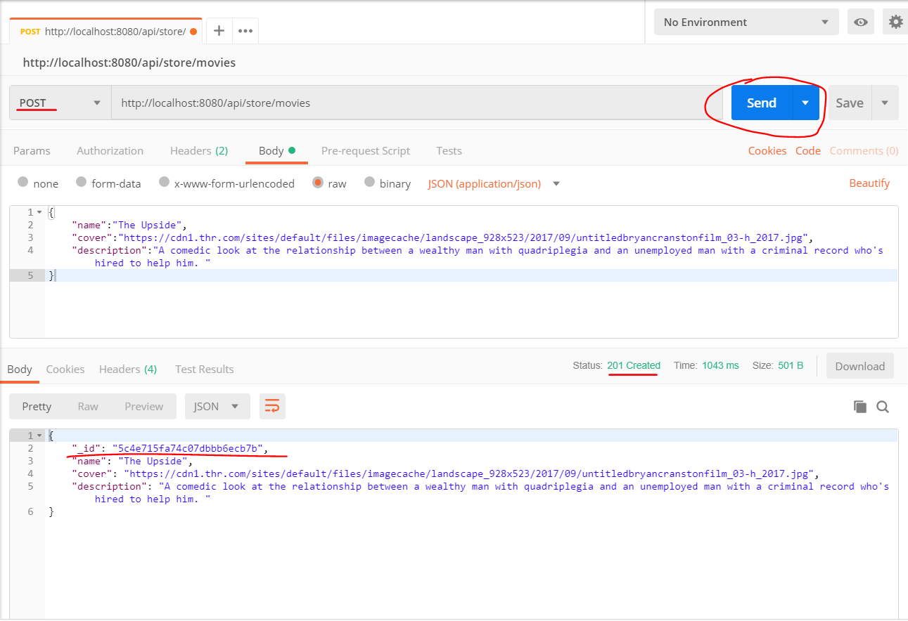

# Build RESTful API with the official MongoDB Go Driver and Iris 

Article is coming soon, follow and stay tuned

- <https://medium.com/@kataras>
- <https://dev.to/kataras>

Read [the fully functional example](main.go).

```sh
$ go get -u github.com/mongodb/mongo-go-driver
$ go get -u github.com/joho/godotenv
```


```sh
# .env file contents
PORT=8080
DSN=mongodb://localhost:27017
```

```sh
$ go run main.go
> 2019/01/28 05:17:59 Loading environment variables from file: .env
> 2019/01/28 05:17:59 ◽ PORT=8080
> 2019/01/28 05:17:59 ◽ DSN=mongodb://localhost:27017
> Now listening on: http://localhost:8080
```

```sh
GET    :  http://localhost:8080/api/store/movies
POST   :  http://localhost:8080/api/store/movies
GET    :  http://localhost:8080/api/store/movies/{id}
PUT    :  http://localhost:8080/api/store/movies/{id}
DELETE :  http://localhost:8080/api/store/movies/{id}
```

## Screens

### Add a Movie


### Update a Movie


### Get all Movies


### Get a Movie by its ID


### Delete a Movie by its ID


