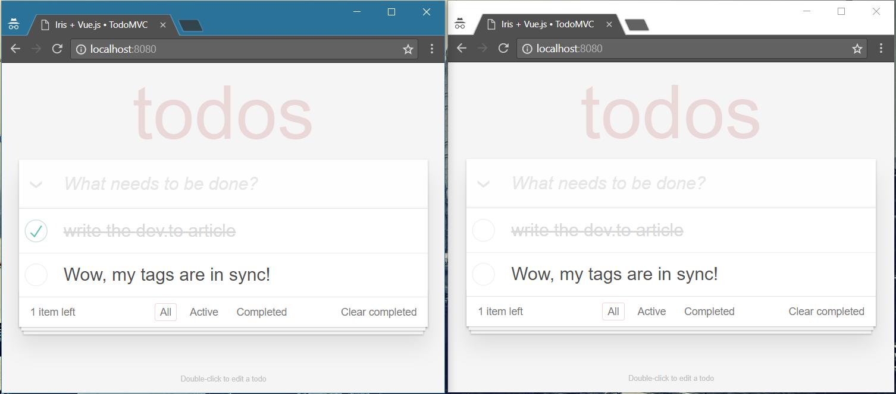

# A Todo MVC Application using Iris and Vue.js

Vue.js is a front-end framework for building web applications using javascript. It has a blazing fast Virtual DOM renderer.

Iris is a back-end framework for building web applications using The Go Programming Language (disclaimer: author here). It's one of the fastest and featured web frameworks out there. We wanna use this to serve our "todo service".

## The Tools

Programming Languages are just tools for us, but we need a safe, fast and “cross-platform” programming language to power our service.

[Go](https://golang.org) is a [rapidly growing](https://www.tiobe.com/tiobe-index/) open source programming language designed for building simple, fast, and reliable software. Take a look [here](https://github.com/golang/go/wiki/GoUsers) which great companies use Go to power their services.

### Install the Go Programming Language

Extensive information about downloading & installing Go can be found [here](https://golang.org/dl/).

[](https://youtu.be/9x-pG3lvLi0)

> Maybe [Windows](https://www.youtube.com/watch?v=WT5mTznJBS0) or [Mac OS X](https://www.youtube.com/watch?v=5qI8z_lB5Lw) user?

> The article does not contain an introduction to the language itself, if you’re a newcomer I recommend you to bookmark this article, [learn](https://github.com/golang/go/wiki/Learn) the language’s fundamentals and come back later on.

## The Dependencies

Many articles have been written, in the past, that lead developers not to use a web framework because they are useless and "bad". I have to tell you that there is no such thing, it always depends on the (web) framework that you’re going to use. At production environment,  we don’t have the time or the experience to code everything that we wanna use in the applications, and if we could are we sure that we can do better and safely than others? In short term: **Good frameworks are helpful tools for any developer, company or startup and "bad" frameworks are waste of time, crystal clear.**

You’ll need two dependencies:

1. Vue.js, for our client-side requirements. Download it from [here](https://vuejs.org/), latest v2.
2. The Iris Web Framework, for our server-side requirements. Can be found [here](https://github.com/kataras/iris), latest v11.

> If you have Go already installed then just execute `go get -u github.com/kataras/iris` to install the Iris Web Framework.

## Start

If we are all in the same page, it’s time to learn how we can create a live todo application that will be easy to deploy and extend even more!

We're going to use a vue.js todo application which uses browser'
s local storage and doesn't have any user-specified features like live sync between browser's tabs, you can find the original version inside the vue's [docs](https://vuejs.org/v2/examples/todomvc.html).

Assuming that you know how %GOPATH% works, create an empty folder, i.e "vuejs-todo-mvc" in the %GOPATH%/src directory, there you will create those files:

- web/public/js/app.js
- web/public/index.html
- todo/item.go
- todo/service.go
- web/controllers/todo_controller.go
- web/main.go

_Read the comments in the source code, they may be very helpful_

### The client-side (vue.js)

```js
/* file: vuejs-todo-mvc/web/public/js/app.js */
// Full spec-compliant TodoMVC with Iris
// and hash-based routing in ~200 effective lines of JavaScript.

var socket = new Ws("ws://localhost:8080/todos/sync");

socket.On("saved", function () {
  // console.log("receive: on saved");
  fetchTodos(function (items) {
    app.todos = items
  });
});


function fetchTodos(onComplete) {
  axios.get("/todos").then(response => {
    if (response.data === null) {
      return;
    }

    onComplete(response.data);
  });
}

var todoStorage = {
  fetch: function () {
    var todos = [];
    fetchTodos(function (items) {
      for (var i = 0; i < items.length; i++) {
        todos.push(items[i]);
      }
    });
    return todos;
  },
  save: function (todos) {
    axios.post("/todos", JSON.stringify(todos)).then(response => {
      if (!response.data.success) {
        window.alert("saving had a failure");
        return;
      }
      // console.log("send: save");
      socket.Emit("save")
    });
  }
}

// visibility filters
var filters = {
  all: function (todos) {
    return todos
  },
  active: function (todos) {
    return todos.filter(function (todo) {
      return !todo.completed
    })
  },
  completed: function (todos) {
    return todos.filter(function (todo) {
      return todo.completed
    })
  }
}

// app Vue instance
var app = new Vue({
  // app initial state
  data: {
    todos: todoStorage.fetch(),
    newTodo: '',
    editedTodo: null,
    visibility: 'all'
  },

  // we will not use the "watch" as it works with the fields like "hasChanges"
  // and callbacks to make it true but let's keep things very simple as it's just a small getting started. 
  // // watch todos change for persistence
  // watch: {
  //   todos: {
  //     handler: function (todos) {
  //       if (app.hasChanges) {
  //         todoStorage.save(todos);
  //         app.hasChanges = false;
  //       }

  //     },
  //     deep: true
  //   }
  // },

  // computed properties
  // http://vuejs.org/guide/computed.html
  computed: {
    filteredTodos: function () {
      return filters[this.visibility](this.todos)
    },
    remaining: function () {
      return filters.active(this.todos).length
    },
    allDone: {
      get: function () {
        return this.remaining === 0
      },
      set: function (value) {
        this.todos.forEach(function (todo) {
          todo.completed = value
        })
        this.notifyChange();
      }
    }
  },

  filters: {
    pluralize: function (n) {
      return n === 1 ? 'item' : 'items'
    }
  },

  // methods that implement data logic.
  // note there's no DOM manipulation here at all.
  methods: {
    notifyChange: function () {
      todoStorage.save(this.todos)
    },
    addTodo: function () {
      var value = this.newTodo && this.newTodo.trim()
      if (!value) {
        return
      }
      this.todos.push({
        id: this.todos.length + 1, // just for the client-side.
        title: value,
        completed: false
      })
      this.newTodo = ''
      this.notifyChange();
    },

    completeTodo: function (todo) {
      if (todo.completed) {
        todo.completed = false;
      } else {
        todo.completed = true;
      }
      this.notifyChange();
    },
    removeTodo: function (todo) {
      this.todos.splice(this.todos.indexOf(todo), 1)
      this.notifyChange();
    },

    editTodo: function (todo) {
      this.beforeEditCache = todo.title
      this.editedTodo = todo
    },

    doneEdit: function (todo) {
      if (!this.editedTodo) {
        return
      }
      this.editedTodo = null
      todo.title = todo.title.trim();
      if (!todo.title) {
        this.removeTodo(todo);
      }
      this.notifyChange();
    },

    cancelEdit: function (todo) {
      this.editedTodo = null
      todo.title = this.beforeEditCache
    },

    removeCompleted: function () {
      this.todos = filters.active(this.todos);
      this.notifyChange();
    }
  },

  // a custom directive to wait for the DOM to be updated
  // before focusing on the input field.
  // http://vuejs.org/guide/custom-directive.html
  directives: {
    'todo-focus': function (el, binding) {
      if (binding.value) {
        el.focus()
      }
    }
  }
})

// handle routing
function onHashChange() {
  var visibility = window.location.hash.replace(/#\/?/, '')
  if (filters[visibility]) {
    app.visibility = visibility
  } else {
    window.location.hash = ''
    app.visibility = 'all'
  }
}

window.addEventListener('hashchange', onHashChange)
onHashChange()

// mount
app.$mount('.todoapp')
```

Let's add our view, the static html.

```html
<!-- file: vuejs-todo-mvc/web/public/index.html -->
<!doctype html>
<html data-framework="vue">

<head>
  <meta charset="utf-8">
  <title>Iris + Vue.js • TodoMVC</title>
  <link rel="stylesheet" href="https://unpkg.com/todomvc-app-css@2.0.4/index.css">
  <!-- this needs to be loaded before guide's inline scripts -->
  <script src="https://vuejs.org/js/vue.js"></script>
  <!-- $http -->
  <script src="https://unpkg.com/axios/dist/axios.min.js"></script>
  <!-- -->
  <script src="https://unpkg.com/director@1.2.8/build/director.js"></script>
  <!-- websocket sync between multiple tabs -->
  <script src="/todos/iris-ws.js"></script>
  <!-- -->
  <style>
    [v-cloak] {
      display: none;
    }
  </style>
</head>

<body>
  <section class="todoapp">
    <header class="header">
      <h1>todos</h1>
      <input class="new-todo" autofocus autocomplete="off" placeholder="What needs to be done?" v-model="newTodo" @keyup.enter="addTodo">
    </header>
    <section class="main" v-show="todos.length" v-cloak>
      <input class="toggle-all" type="checkbox" v-model="allDone">
      <ul class="todo-list">
        <li v-for="todo in filteredTodos" class="todo" :key="todo.id" :class="{ completed: todo.completed, editing: todo == editedTodo }">
          <div class="view">
             <!-- v-model="todo.completed" -->
            <input class="toggle" type="checkbox" @click="completeTodo(todo)">
            <label @dblclick="editTodo(todo)">{{ todo.title }}</label>
            <button class="destroy" @click="removeTodo(todo)"></button>
          </div>
          <input class="edit" type="text" v-model="todo.title" v-todo-focus="todo == editedTodo" @blur="doneEdit(todo)" @keyup.enter="doneEdit(todo)"
            @keyup.esc="cancelEdit(todo)">
        </li>
      </ul>
    </section>
    <footer class="footer" v-show="todos.length" v-cloak>
      <span class="todo-count">
        <strong>{{ remaining }}</strong> {{ remaining | pluralize }} left
      </span>
      <ul class="filters">
        <li>
          <a href="#/all" :class="{ selected: visibility == 'all' }">All</a>
        </li>
        <li>
          <a href="#/active" :class="{ selected: visibility == 'active' }">Active</a>
        </li>
        <li>
          <a href="#/completed" :class="{ selected: visibility == 'completed' }">Completed</a>
        </li>
      </ul>
      <button class="clear-completed" @click="removeCompleted" v-show="todos.length > remaining">
        Clear completed
      </button>
    </footer>
  </section>
  <footer class="info">
    <p>Double-click to edit a todo</p>
  </footer>

  <script src="/js/app.js"></script>
</body>

</html>
```

### The server-side (iris)

Our view model.

```go
// file: vuejs-todo-mvc/todo/item.go
package todo

type Item struct {
    SessionID string `json:"-"`
    ID        int64  `json:"id,omitempty"`
    Title     string `json:"title"`
    Completed bool   `json:"completed"`
}
```

Our service.

```go
// file: vuejs-todo-mvc/todo/service.go
package todo

import (
    "sync"
)

type Service interface {
    Get(owner string) []Item
    Save(owner string, newItems []Item) error
}

type MemoryService struct {
    // key = session id, value the list of todo items that this session id has.
    items map[string][]Item
    // protected by locker for concurrent access.
    mu sync.RWMutex
}

func NewMemoryService() *MemoryService {
    return &MemoryService{
        items: make(map[string][]Item, 0),
    }
}

func (s *MemoryService) Get(sessionOwner string) []Item {
    s.mu.RLock()
    items := s.items[sessionOwner]
    s.mu.RUnlock()

    return items
}

func (s *MemoryService) Save(sessionOwner string, newItems []Item) error {
    var prevID int64
    for i := range newItems {
        if newItems[i].ID == 0 {
            newItems[i].ID = prevID
            prevID++
        }
    }

    s.mu.Lock()
    s.items[sessionOwner] = newItems
    s.mu.Unlock()
    return nil
}
```

We are going to use some of the MVC functionalities of the iris web framework here but you can do the same with the standard API as well.

```go
// file: vuejs-todo-mvc/controllers/todo_controller.go
package controllers

import (
    "vuejs-todo-mvc/todo"

    "github.com/kataras/iris"
    "github.com/kataras/iris/mvc"
    "github.com/kataras/iris/sessions"
    "github.com/kataras/iris/websocket"
)

// TodoController is our TODO app's web controller.
type TodoController struct {
    Service todo.Service

    Session *sessions.Session
}

// BeforeActivation called once before the server ran, and before
// the routes and dependencies binded.
// You can bind custom things to the controller, add new methods, add middleware,
// add dependencies to the struct or the method(s) and more.
func (c *TodoController) BeforeActivation(b mvc.BeforeActivation) {
    // this could be binded to a controller's function input argument
    // if any, or struct field if any:
    b.Dependencies().Add(func(ctx iris.Context) (items []todo.Item) {
        ctx.ReadJSON(&items)
        return
    })
}

// Get handles the GET: /todos route.
func (c *TodoController) Get() []todo.Item {
    return c.Service.Get(c.Session.ID())
}

// PostItemResponse the response data that will be returned as json
// after a post save action of all todo items.
type PostItemResponse struct {
    Success bool `json:"success"`
}

var emptyResponse = PostItemResponse{Success: false}

// Post handles the POST: /todos route.
func (c *TodoController) Post(newItems []todo.Item) PostItemResponse {
    if err := c.Service.Save(c.Session.ID(), newItems); err != nil {
        return emptyResponse
    }

    return PostItemResponse{Success: true}
}

func (c *TodoController) GetSync(conn websocket.Connection) {
    conn.Join(c.Session.ID())
    conn.On("save", func() { // "save" event from client.
        conn.To(c.Session.ID()).Emit("saved", nil) // fire a "saved" event to the rest of the clients w.
    })

    conn.Wait()
}
```

And finally our main application's endpoint.

```go
// file: web/main.go
package main

import (
    "vuejs-todo-mvc/todo"
    "vuejs-todo-mvc/web/controllers"

    "github.com/kataras/iris"
    "github.com/kataras/iris/sessions"
    "github.com/kataras/iris/websocket"

    "github.com/kataras/iris/mvc"
)

func main() {
    app := iris.New()

    // serve our app in public, public folder
    // contains the client-side vue.js application,
    // no need for any server-side template here,
    // actually if you're going to just use vue without any
    // back-end services, you can just stop afer this line and start the server.
    app.StaticWeb("/", "./public")

    // configure the http sessions.
    sess := sessions.New(sessions.Config{
        Cookie: "iris_session",
    })

    // configure the websocket server.
    ws := websocket.New(websocket.Config{})

    // create a sub router and register the client-side library for the iris websockets,
    // you could skip it but iris websockets supports socket.io-like API.
    todosRouter := app.Party("/todos")
    // http://localhost:8080/todos/iris-ws.js
    // serve the javascript client library to communicate with
    // the iris high level websocket event system.
    todosRouter.Any("/iris-ws.js", websocket.ClientHandler())

    // create our mvc application targeted to /todos relative sub path.
    todosApp := mvc.New(todosRouter)

    // any dependencies bindings here...
    todosApp.Register(
        todo.NewMemoryService(),
        sess.Start,
        ws.Upgrade,
    )

    // controllers registration here...
    todosApp.Handle(new(controllers.TodoController))

    // start the web server at http://localhost:8080
    app.Run(iris.Addr(":8080"))
}
```

Run the Iris web server you've just created by executing `go run main.go` from your current path (%GOPATH%/src/%your_folder%/web/).

```sh
$ go run main.go
Now listening on: http://localhost:8080
Application Started. Press CTRL+C to shut down.
_
```

Open one or more browser tabs at: http://localhost:8080 and have fun!



### Download the Source Code

The whole project, all the files you saw in this article are located at: https://github.com/kataras/iris/tree/master/_examples/tutorial/vuejs-todo-mvc

## References

https://vuejs.org/v2/examples/todomvc.html (using browser's local storage)

https://github.com/kataras/iris/tree/master/_examples/mvc (mvc examples and features overview repository)

## Thank you, once again

Happy new year and thank you for your pattience, once again:) Don't hesitate to post any questions and provide feedback(I'm very active dev therefore you will be heard here!)

Don't forget to check out my medium profile and twitter as well, I'm posting some (useful) stuff there too:)

- https://medium.com/@kataras 
- https://twitter.com/MakisMaropoulos
