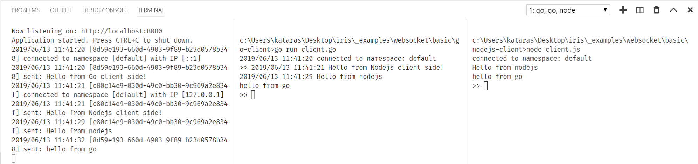

# Basic Example

At the end of this example you will be able to run a websocket server
and clients for all platforms (Go, Browser and Nodejs).



Open as many clients as you want to try out and start typing.

This example contains only the basics, however, the library supports rooms, native websocket messages, any data can be sent and received (i.e protobufs, json) and all kinds of broadcasting and connections collections.

## How to run

### Server

Open a terminal window instance and execute:

```sh
$ go run server.go # start the websocket server.
```

### Client (Go)

Start a new terminal instance and execute:

```sh
$ cd ./go-client
$ go run client.go # start the websocket client.
# start typing...
```

### Client (Browser)

Navigate to <http://localhost:8080> and start typing.
The `./browser/index.html` should be served, it contains the client-side code.

### Client (Browserify)

Install [NPM](https://nodejs.org) first, then start a new terminal instance and execute:

```sh
$ cd ./browserify
$ npm install
# build the modern browser-side client:
# embed the neffos.js node-module and app.js
# into a single ./browserify/bundle.js file
# which ./browserify/client.html imports.
$ npm run-script build
```

Navigate to <http://localhost:8080/browserify/client.html> and start typing.

### Client (Nodejs)

Install [NPM](https://nodejs.org) if you haven't already and then, start a new terminal instance and execute:

```sh
$ cd nodejs-client
$ npm install
$ node client.js # start the websocket client.
# start typing.
```
